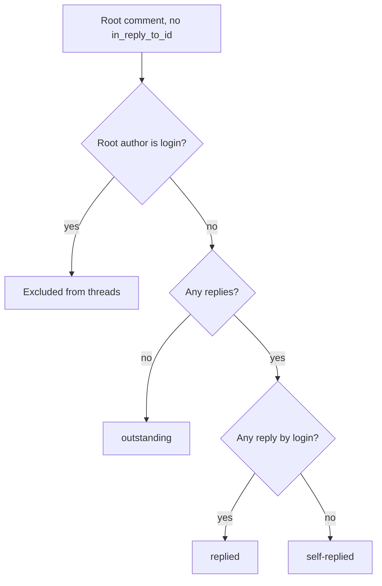

# tool-received-review-verify Specification

## Purpose
MCP tool `received_review_verify` fetches every review comment thread on a pull request and classifies each one by whether the PR author has replied; the `received-review` skill calls it for triage and post-reply checks. In write mode it saves drafted reply bodies for link validation. Output follows docs/mcp-output-contract.md.

## Requirements

### Requirement: Registration and annotations
The tool SHALL be registered as `received_review_verify` with the title "Verify review replies posted", a description starting with `INTERNAL — called by sdlc skills only.`, and the annotations below.

| Annotation | Value |
|---|---|
| `ReadOnly` | `true` |
| `Idempotent` | `true` |
| `OpenWorld` | `true` |

#### Scenario: Client lists tools
- **WHEN** an MCP client lists the server's tools
- **THEN** `received_review_verify` is present with `ReadOnly: true`, `Idempotent: true`, `OpenWorld: true`

### Requirement: Input fields and modes
The tool SHALL run in classify mode by default and in write mode when `writeReplyBodies` is `true`.

| Field | Type | Required | Encoding | Meaning |
|---|---|---|---|---|
| `pr` | int | classify mode | JSON number, e.g. `42` | Pull request number. |
| `login` | string | no | plain text, e.g. `octocat` | GitHub login of the PR author. Defaults to the current `gh` user. |
| `writeReplyBodies` | bool | no | JSON boolean | Selects write mode. `pr` and `login` are ignored. |
| `content` | string | write mode | plain text, one reply body per line | Reply bodies to save verbatim. |

| Mode | Trigger | Config-version gate | Network |
|---|---|---|---|
| Classify | `writeReplyBodies` absent or `false` | yes | `gh` calls |
| Write | `writeReplyBodies: true` | no | none |

#### Scenario: Write mode ignores pr
- **WHEN** `writeReplyBodies` is `true`, `content` is non-empty, and `pr` is `0`
- **THEN** the call succeeds and writes the file

### Requirement: Config-version gate
In classify mode the tool SHALL fail with a `DataError` whose message starts with `config-version:` when `.sdlc-v2/` exists in the main worktree root but `.sdlc-v2/config.toml` does not.

- The suggestion says to run `/setup`, then retry with the same `pr`.
- There is no input field to skip this gate.

#### Scenario: JSON-era project
- **WHEN** the main worktree root has `.sdlc-v2/` and no `.sdlc-v2/config.toml`
- **THEN** the call fails with a `DataError` starting with `config-version:`

### Requirement: PR number validation
In classify mode the tool SHALL fail with a `DomainError` `pr must be a positive integer` when `pr` is `0` or negative.

#### Scenario: Missing pr
- **WHEN** `received_review_verify` is called with `pr: 0` and `writeReplyBodies` unset
- **THEN** the call fails with a `DomainError` `pr must be a positive integer`

### Requirement: Repository detection
The tool SHALL read the `origin` URL with `git remote get-url origin` in the active worktree and SHALL parse `owner` and `repo` from it.

| Remote URL form | Example |
|---|---|
| HTTPS | `https://github.com/owner/repo.git` |
| SCP-style SSH | `git@github.com:owner/repo.git` |
| SSH URL | `ssh://git@github.com/owner/repo.git` |

#### Scenario: No origin remote
- **WHEN** the active worktree has no remote named `origin`
- **THEN** the call fails with an `InfraError` starting with `get git remote URL:`

#### Scenario: Unparsable remote
- **WHEN** the `origin` URL has no owner/repo path
- **THEN** the call fails with an `InfraError` starting with `parse remote owner/repo:`

### Requirement: PR author login
The tool SHALL use `login` as-is when it is non-empty, and SHALL otherwise resolve it with `gh api user --jq .login`.

#### Scenario: Explicit login
- **WHEN** `login` is `author`
- **THEN** the tool does not call `gh api user`
- **AND** classifies threads relative to `author`

#### Scenario: gh not authenticated
- **WHEN** `login` is empty and `gh api user` fails
- **THEN** the call fails with an `InfraError` starting with `resolve current gh login:`
- **AND** the suggestion contains `gh auth login --hostname github.com` and mentions passing the `login` field

### Requirement: Comment fetch
The tool SHALL fetch all review comments in one paginated call: `gh api repos/{owner}/{repo}/pulls/{pr}/comments --paginate`.

- Each comment is read as `{id, path, line, login, body, in_reply_to_id}`.

#### Scenario: Fetch fails
- **WHEN** the `gh api` comments call fails
- **THEN** the call fails with an `InfraError` starting with `fetch PR review comments:`

### Requirement: Thread classification
The tool SHALL group comments into threads by root comment (no `in_reply_to_id`) and SHALL give each thread one `status`: `outstanding`, `self-replied`, or `replied`.

Classification of one root comment relative to `login`.

- A reply belongs to the root whose `id` equals its `in_reply_to_id`.
- A reply from anyone other than `login` (reviewer or third party) never makes a thread `replied`.

| Thread field | Meaning |
|---|---|
| `id` | Root comment id (REST). |
| `path` | File path of the root comment. |
| `line` | Line of the root comment; omitted when `0`. |
| `reviewer` | Login of the root comment author. |
| `body` | Root comment body. |
| `status` | `outstanding`, `self-replied`, or `replied`. |
| `replyCount` | Number of replies to the root. |

#### Scenario: Three statuses in one PR
- **WHEN** login is `octocat` and the PR has root 1 with no replies, root 2 with one reply by its own reviewer, root 4 with one reply by `octocat`, and root 6 authored by `octocat`
- **THEN** `threads` has 3 entries: root 1 `outstanding` (`replyCount` 0), root 2 `self-replied` (`replyCount` 1), root 4 `replied` (`replyCount` 1)
- **AND** root 6 is not in `threads`

#### Scenario: Reply from a bystander
- **WHEN** a root by `reviewer1` has one reply by `bystander` and login is `octocat`
- **THEN** that thread's `status` is `self-replied`

#### Scenario: No comments
- **WHEN** the PR has no review comments
- **THEN** `threads` is empty and `total` is `0`

### Requirement: Classify-mode output
In classify mode the tool SHALL return the fields below.

| Field | Meaning |
|---|---|
| `version` | Always `1`. |
| `timestamp` | Call time, RFC3339, UTC. |
| `pr` | `{number, owner, repo}`. |
| `threads` | Classified threads. |
| `outstanding` | Threads whose `status` is not `replied` (includes `self-replied`). |
| `replied` | Threads whose `status` is `replied`. |
| `total` | Number of threads; equals `outstanding + replied`. |
| `next` | See below. |

| Condition | `next` |
|---|---|
| `outstanding > 0` | `Outstanding review threads remain — reply to each and address the feedback before proceeding.` |
| `outstanding == 0` | `All review threads have a reply from the PR author. Safe to proceed.` |

#### Scenario: Counts for the three-status fixture
- **WHEN** the three-status fixture is fetched for `pr: 42` from `https://github.com/owner/repo.git`
- **THEN** `pr` is `{number: 42, owner: "owner", repo: "repo"}`
- **AND** `total` is `3`, `outstanding` is `2`, `replied` is `1`
- **AND** `next` starts with `Outstanding review threads remain`

#### Scenario: All threads answered
- **WHEN** every thread has a reply from `login`
- **THEN** `outstanding` is `0`
- **AND** `next` is `All review threads have a reply from the PR author. Safe to proceed.`

### Requirement: Write mode
When `writeReplyBodies` is `true` the tool SHALL write `content` verbatim to `.sdlc-v2/state/artifacts/received-review-reply-bodies.md` under the main worktree root, overwriting any existing file.

- `.sdlc-v2/state/artifacts/` is created when missing.
- The result has `version: 1`, a `timestamp`, `threads: []`, zero counts, and a zero-value `pr`.
- `next` is `Reply bodies written — call links_validate with the same file path before posting.`

#### Scenario: Reply bodies saved
- **WHEN** `writeReplyBodies` is `true` and `content` is `## Reply to thread 1\n\nDone.\n`
- **THEN** `.sdlc-v2/state/artifacts/received-review-reply-bodies.md` contains exactly that content
- **AND** `next` is non-empty

#### Scenario: Empty content
- **WHEN** `writeReplyBodies` is `true` and `content` is empty
- **THEN** the call fails with a `DomainError` `received_review_verify: content is required when writeReplyBodies is true`

### Requirement: Error cases
The tool SHALL report each failure below with the listed error class.

| Condition | Class | Message / Suggestion (short) |
|---|---|---|
| Main worktree root cannot be resolved | `InfraError` | `resolve project root: ...` / run inside a git repository or worktree |
| `.sdlc-v2/` without `config.toml` (classify mode) | `DataError` | `config-version: ...` / run `/setup` |
| `pr` is `0` or negative (classify mode) | `DomainError` | `pr must be a positive integer` / look up the PR number |
| `git remote get-url origin` fails | `InfraError` | `get git remote URL: ...` / add an `origin` remote |
| `origin` URL cannot be parsed | `InfraError` | `parse remote owner/repo: ...` / use an owner/repo URL |
| `gh api user` fails and no `login` | `InfraError` | `resolve current gh login: ...` / `gh auth login --hostname github.com` or pass `login` |
| Comment fetch fails | `InfraError` | `fetch PR review comments: ...` / check `gh auth status` and `pr` |
| Write mode, empty `content` | `DomainError` | `received_review_verify: content is required when writeReplyBodies is true` |
| Write mode, directory cannot be created | `InfraError` | `create <dir>: ...` |
| Write mode, file write fails | `InfraError` | `write <path>: ...` |

#### Scenario: Active worktree cannot be resolved
- **WHEN** the active worktree root cannot be resolved but the main root can
- **THEN** the tool runs git and `gh` commands in the main root
