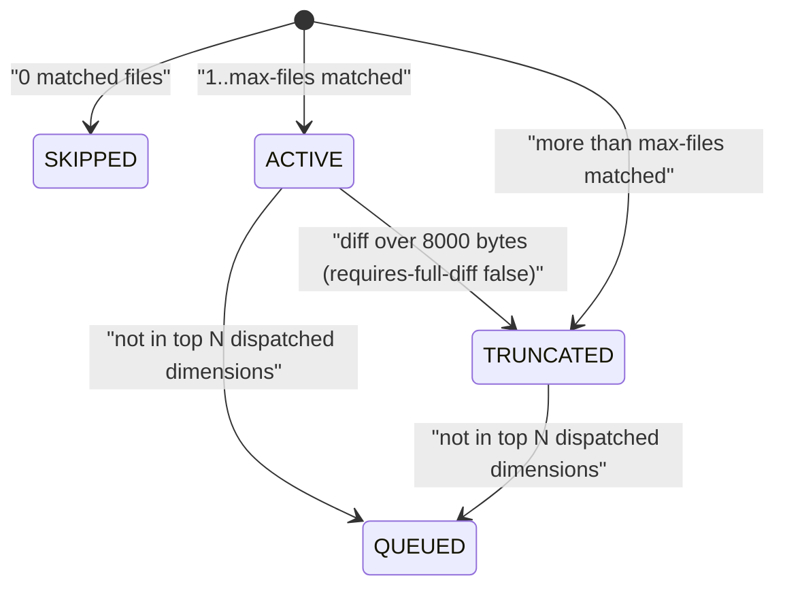

# tool-review-prepare Specification

## Purpose
MCP tool `review_prepare` pre-computes everything the `review` skill needs before it dispatches one reviewer per dimension: changed files, dimension matching, per-dimension diff and slice files, commit context, and a plan critique. It also saves a finished review comment under `.sdlc-v2/reviews/` in save mode. Output follows docs/mcp-output-contract.md.

## Requirements

### Requirement: Registration and annotations
The tool SHALL be registered as `review_prepare` with the title "Prepare code review payload" and the annotations below.

| Annotation | Value |
|---|---|
| `ReadOnly` | `true` |
| `Idempotent` | `true` |
| `OpenWorld` | `true` (the PR lookup calls the GitHub API through `gh`) |

#### Scenario: Client lists tools
- **WHEN** an MCP client lists the server's tools
- **THEN** `review_prepare` is present with `ReadOnly: true`, `Idempotent: true`, `OpenWorld: true`

### Requirement: Input fields and modes
The tool SHALL run in manifest mode by default and in save mode when `saveReview` is `true`.

| Field | Type | Required | Encoding | Meaning |
|---|---|---|---|---|
| `target` | string | no | plain text, e.g. `main` | Base branch/ref to diff against. Overrides the detected default branch. Ignored for scopes `staged` and `working`. |
| `skipConfigCheck` | bool | no | JSON boolean | Skips the config-version gate. |
| `saveReview` | bool | no | JSON boolean | Selects save mode. All other fields except `content` are ignored. |
| `content` | string | when `saveReview` is `true` | plain text (Markdown) | Review comment body to save verbatim. |

| Mode | Trigger | Config-version gate | Result |
|---|---|---|---|
| Manifest | `saveReview` absent or `false` | yes, unless `skipConfigCheck` | `manifestPath` + `summary` |
| Save | `saveReview: true` | no | `saved: true` + `next` |

#### Scenario: Save mode skips the manifest work
- **WHEN** `review_prepare` is called with `saveReview: true` and a non-empty `content`
- **THEN** no manifest, diff, or slice file is written
- **AND** the config-version gate does not run

### Requirement: Config-version gate
In manifest mode the tool SHALL fail with a `DataError` whose message starts with `config-version:` when `.sdlc-v2/config.json` exists in the main worktree root but `.sdlc-v2/config.toml` does not, unless `skipConfigCheck` is `true`.

#### Scenario: JSON-era project without config.toml
- **WHEN** the main worktree root has a `.sdlc-v2/` directory and no `.sdlc-v2/config.toml`
- **AND** `skipConfigCheck` is `false`
- **THEN** the call fails with a `DataError` starting with `config-version:`
- **AND** the suggestion points to the `migrate` tool with action `config`

#### Scenario: Gate bypassed
- **WHEN** `skipConfigCheck` is `true`
- **THEN** the config-version check is not run

### Requirement: Scope resolution
The tool SHALL read the review scope from key `scope` of the `[review]` section in `.sdlc-v2/local.toml` under the main worktree root, and SHALL use `all` when the key is missing or not one of the valid values.

| Scope | Changed-files command | Diff command | Base branch needed |
|---|---|---|---|
| `all` (default) | `git diff --name-only <base>...HEAD` | `git diff <base>...HEAD` | yes |
| `committed` | `git diff --name-only <base>...HEAD` | `git diff <base>...HEAD` | yes |
| `staged` | `git diff --name-only --cached` | `git diff --cached` | no |
| `working` | `git diff --name-only HEAD` | `git diff HEAD` | no |
| `worktree` | `git diff --name-only <base>` | `git diff <base>` | yes |

- All git commands run in the active worktree.
- There is no input field for scope.

#### Scenario: No review section
- **WHEN** `.sdlc-v2/local.toml` has no `[review]` section
- **THEN** the manifest `scope` is `all`

#### Scenario: Invalid scope value
- **WHEN** `[review] scope` is `everything`
- **THEN** the tool uses scope `all`

### Requirement: Base branch resolution
For scopes `all`, `committed` and `worktree` the tool SHALL use `target` as the base ref when it is non-empty, and otherwise SHALL detect the default branch from `refs/remotes/origin/HEAD`, then a local `main`, then a local `master`. For scopes `staged` and `working` the tool SHALL use no base ref and SHALL ignore `target`.

#### Scenario: Explicit target
- **WHEN** `target` is `main`
- **THEN** changed files are computed against `main`

#### Scenario: Default branch cannot be detected
- **WHEN** `target` is empty and scope is `all`
- **AND** there is no `origin/HEAD`, no `main`, and no `master`
- **THEN** the call fails with an `InfraError` starting with `detect base branch:`
- **AND** the suggestion says to pass `target` or set `review.scope` to `staged` or `working`

#### Scenario: Local scope needs no base
- **WHEN** scope is `staged` and `target` is empty
- **THEN** no default-branch detection runs
- **AND** the manifest `base_branch` is `null`

#### Scenario: Local scope ignores target
- **WHEN** scope is `working` and `target` is `main`
- **THEN** the changed files come from `git diff --name-only HEAD`
- **AND** the manifest `base_branch` is `null`

### Requirement: No changed files
The tool SHALL fail with a `DomainError` with message `No changed files found` when the changed-files command for the resolved scope succeeds and returns no files.

#### Scenario: Branch equal to base
- **WHEN** HEAD has no changes relative to `target: main`
- **THEN** the call fails with a `DomainError` `No changed files found`

### Requirement: Changed-files git failure
The tool SHALL fail with a `DomainError` that carries git's error text when the changed-files git command fails, and SHALL NOT report `No changed files found` in that case.

- With a base ref, the message is `git diff against base ref "<base>" failed: <git error>`. The suggestion says to check the ref with `git rev-parse --verify` or fetch it.
- Without a base ref (scopes `staged` and `working`), the message is `git diff for scope <scope> failed: <git error>`.

#### Scenario: Unresolvable target ref
- **WHEN** `target` is `no-such-ref` and git cannot resolve it
- **THEN** the call fails with a `DomainError` whose message names `"no-such-ref"`
- **AND** the message contains git's own error text, for example `unknown revision`
- **AND** the message is not `No changed files found`

### Requirement: Dimension loading
The tool SHALL load review dimensions from every `*.md` file in `.sdlc-v2/review-dimensions/` of the active worktree, except `_common.md`, in filename order.

- A file is skipped when its YAML frontmatter is missing or cannot be parsed.
- A file is skipped when `name` is missing or empty, or `triggers` is missing or empty.
- `severity` defaults to `medium` when absent or empty.
- `model` is copied to the index entry when it is a non-empty string; otherwise it is `null`.
- `requires-full-diff` and `max-files` are read from frontmatter (see status and truncation requirements).
- Frontmatter fields are documented in `plugins/sdlc/schemas/review-dimension.schema.json`.
- A missing folder counts as no dimensions. A folder that exists but cannot be listed fails the call with an `InfraError` `list <dir>: <cause>`; it is never reported as `No review dimensions found`.

#### Scenario: No usable dimension
- **WHEN** `.sdlc-v2/review-dimensions/` is missing or holds no usable dimension file
- **THEN** the call fails with a `DomainError` `No review dimensions found in .sdlc-v2/review-dimensions/`
- **AND** the suggestion points to `migrate` action `import` or to adding dimension files

#### Scenario: Dimensions folder cannot be listed
- **WHEN** `.sdlc-v2/review-dimensions` is a regular file, not a directory
- **THEN** the call fails with an `InfraError` whose message starts with `list `
- **AND** the message is not `No review dimensions found in .sdlc-v2/review-dimensions/`

#### Scenario: Dimension without triggers
- **WHEN** a dimension file has `name: docs` and no `triggers`
- **THEN** that dimension does not appear in the manifest

### Requirement: File matching with globs
The tool SHALL match each changed file path against a dimension's `triggers` globs, drop files that also match a `skip-when` glob, and anchor every glob to the whole path.

| Glob token | Matches |
|---|---|
| `*` | Any characters except `/` |
| `**/` | Zero or more whole path segments |
| `**` (not followed by `/`) | Any characters, including `/` |
| `?` | One character except `/` |
| `[...]` | A character class, as written |
| `{a,b}` | Not supported; braces are literal |
| Other regex characters (`.` `+` `(` ...) | Literal |

#### Scenario: Double-star prefix matches root files
- **WHEN** a trigger is `**/*.go`
- **THEN** `main.go` and `a/b/c/test.go` match
- **AND** `main.go.bak` does not match

#### Scenario: Single star stays in one segment
- **WHEN** a trigger is `*.go`
- **THEN** `main.go` matches
- **AND** `src/main.go` does not match

#### Scenario: Brace expansion is not supported
- **WHEN** a trigger is `*.{ts,tsx}`
- **THEN** `foo.ts` does not match

#### Scenario: skip-when excludes a match
- **WHEN** triggers are `**/*.go` and `skip-when` is `**/vendor/**`
- **THEN** `vendor/lib/dep.go` is not a matched file

### Requirement: Dimension status
The tool SHALL give every loaded dimension exactly one status: `ACTIVE`, `SKIPPED`, `TRUNCATED`, or `QUEUED`.

Status transitions for one dimension during a single call (N is the dimension cap).

- `max-files` defaults to `100`; only a positive integer overrides it.
- When more than `max-files` files match, only the first `max-files` are kept and `truncated` is `true`.
- For a dispatched dimension cut by `max-files`, the `.diff` file ends with a footer: first line `# --- Truncated (max-files) ---`, then one `# - <path>` line per dropped file. It comes after any diff byte cap footer.
- `QUEUED` is applied before any diff or slice file is written; see the dimension cap requirement. Only dimensions still `ACTIVE` after the cap can become `TRUNCATED` by the diff byte cap.

#### Scenario: max-files cap
- **WHEN** 4 changed files match and `max-files` is `3`
- **THEN** `matched_count` is `3`
- **AND** `truncated` is `true` and status is `TRUNCATED`
- **AND** the `.diff` file ends with a `# --- Truncated (max-files) ---` footer that lists the 4th file as `# - <path>`

#### Scenario: No matched file
- **WHEN** no changed file matches a dimension's triggers
- **THEN** its status is `SKIPPED`
- **AND** its `diff_file` and `slice_file` are `null`

### Requirement: Per-dimension diff and slice files
For every `ACTIVE` or `TRUNCATED` dimension the tool SHALL write `<name>.diff` and `<name>.slice.json` into a new temp directory named `sdlc-review-*` under the system temp directory, and SHALL write neither file for a `SKIPPED` or `QUEUED` dimension.

- `<name>.diff` holds the diff hunks of the dimension's matched files only, joined in matched-file order.
- `<name>.slice.json` is a JSON object with the fields below.

| Field | Meaning |
|---|---|
| `body` | Dimension Markdown body. When `_common.md` is non-empty, it is prefixed with `## Common Review Instructions`, the `_common.md` text, then the body. |
| `matched_files` | Matched file paths. |
| `file_context` | One `{file, commits: [{hash, subject}]}` entry per matched file. Empty for scopes `staged` and `working`. |
| `warnings` | Validation messages for the dimension file (field and severity checks). |

- `file_context` commits come from `git log --format=COMMIT:%H %s --name-only <base>..HEAD`.
- Each `hash` is the first 8 characters of the commit hash.
- At most 5 commits are kept per file.
- The tool never deletes the temp directory; the caller cleans it up.

#### Scenario: Slice for an active dimension
- **WHEN** dimension `code-quality` matches `src/app.go` and `src/util.go`
- **THEN** `code-quality.diff` contains `diff --git` headers for those files
- **AND** `code-quality.slice.json` has a non-empty `body` and 2 `matched_files`

#### Scenario: Queued dimension gets no files
- **WHEN** a dimension is `QUEUED` by the dimension cap
- **THEN** no `<name>.diff` or `<name>.slice.json` file exists for it in `diff_dir`
- **AND** its `diff_file` and `slice_file` are `null`

### Requirement: Diff byte cap
The tool SHALL cap each dimension's diff at 8000 bytes unless the dimension sets `requires-full-diff: true`, and SHALL mark a capped dimension `truncated: true` with status `TRUNCATED`.

- Whole-file hunks are kept largest first; at least one file is always kept.
- Smaller files that still fit are kept after a larger one is dropped.
- A footer starting with `# --- Truncated ---` lists the dropped files as `# - <path>`.
- A diff within 8000 bytes is written unchanged.

#### Scenario: Three large files exceed the cap
- **WHEN** a dimension matches 3 files whose combined diff is over 8000 bytes
- **AND** `requires-full-diff` is not set
- **THEN** `matched_count` is `3`, `truncated` is `true`, and status is `TRUNCATED`
- **AND** the `.diff` file contains `# --- Truncated ---`

#### Scenario: Full diff required
- **WHEN** the dimension sets `requires-full-diff: true`
- **THEN** its `.diff` file holds the full diff for its matched files, with no byte cap

### Requirement: Dimension cap
The tool SHALL keep at most N dispatched dimensions (status `ACTIVE` or `TRUNCATED`), where N is the dimension cap (default 8, see dimension cap configuration), and SHALL change the rest to `QUEUED`.

- `ACTIVE` and `TRUNCATED` dimensions both count toward the cap, because both get a reviewer agent.
- Kept first: higher severity (`critical` > `high` > `medium` > `low` > `info`; unknown ranks as `medium`).
- Tie-break: fewer matched files first.
- A `QUEUED` dimension has `diff_file: null` and `slice_file: null`, and no files are written for it.
- Queued names are listed in `plan_critique.queued_dimensions`.
- `plan_critique.dimension_cap` is N.
- `plan_critique.dimension_cap_applied` is `true` when more than N dimensions were `ACTIVE` or `TRUNCATED`.

#### Scenario: Ten active dimensions
- **WHEN** 10 dimensions are `ACTIVE` before the cap and the cap is 8
- **THEN** 8 stay `ACTIVE` and 2 become `QUEUED`
- **AND** `summary.queued_dimensions` is `2`

#### Scenario: Ten truncated dimensions
- **WHEN** 10 dimensions are `TRUNCATED` by `max-files` before the cap and the cap is 8
- **THEN** 8 stay `TRUNCATED` and 2 become `QUEUED`
- **AND** `summary.active_dimensions` is `8`
- **AND** `plan_critique.dimension_cap_applied` is `true`

#### Scenario: Five active dimensions
- **WHEN** 5 dimensions are `ACTIVE` and the cap is 8
- **THEN** none becomes `QUEUED`

#### Scenario: Critical dimension kept
- **WHEN** 1 `critical` and 8 `info` dimensions are `ACTIVE` and the cap is 8
- **THEN** the `critical` dimension stays `ACTIVE`
- **AND** exactly one `info` dimension becomes `QUEUED`

#### Scenario: Lowest severity queued
- **WHEN** the dispatched severities are `critical, high, medium, low, info, medium, medium, medium, low, info` and the cap is 8
- **THEN** the two `info` dimensions become `QUEUED`

#### Scenario: Equal severity tie-break
- **WHEN** 3 `medium` dimensions match 3, 1, and 2 files and the cap is 2
- **THEN** the dimension with 3 matched files becomes `QUEUED`

#### Scenario: Configured cap above dimension count
- **WHEN** 10 dimensions are `ACTIVE` and the cap is 10
- **THEN** none becomes `QUEUED`
- **AND** `plan_critique.dimension_cap_applied` is `false`

### Requirement: Plan critique
The tool SHALL write a `plan_critique` object into the manifest that describes coverage gaps and overlaps of the dimension plan.

| Field | Meaning |
|---|---|
| `uncovered_files` | Changed files matched by no dimension. |
| `uncovered_suggestions` | `[{dimension, files, reason}]` from the catalog below. |
| `still_uncovered` | Uncovered files that match no catalog entry. |
| `over_broad_dimensions` | Dispatched (`ACTIVE` or `TRUNCATED`) dimensions matching more than 80% of changed files. |
| `overlapping_pairs` | Pairs of dispatched (`ACTIVE` or `TRUNCATED`) dimensions with identical matched-file sets. |
| `dimension_cap` | The dimension cap used for this call. See dimension cap. |
| `dimension_cap_applied` | See dimension cap. |
| `queued_dimensions` | See dimension cap. |

Uncovered-file catalog. The first matching row wins. Matches marked (i) ignore case.

| Suggested dimension | Label | File path matches |
|---|---|---|
| `ci-cd-pipeline-review` | CI/CD workflow | `.github/workflows/`, or `.yml`/`.yaml` containing `ci`, `deploy`, or `pipeline` (i) |
| `ci-cd-pipeline-review` | CI/CD pipeline | `Jenkinsfile` or `.circleci/` (i) |
| `database-migrations-review` | database migration | `migration/` or `migrations/` (i), or ends with `.sql` |
| `internationalization-review` | internationalization | `i18n`, `locale`, `locales`, `translation/`, `translations/` (i) |
| `api-contract-review` | API contract/schema | ends with `.graphql` or `.proto`, or contains `openapi`/`swagger` (i) |
| `documentation-quality-review` | documentation | ends with `.md`, or `doc/`/`docs/` (i) |
| `type-safety-review` | type definition | ends with `.d.ts`, or a `type/`/`types/` segment (i) |
| `state-management-review` | state management | `store`, `state`, `redux`, `zustand`, `pinia` (i) |
| `infrastructure-review` | infrastructure | `Dockerfile`, `docker-compose`, `terraform`, `k8s`, `kubernetes`, or ends with `.dockerfile` or `.tf` (i) |
| `dependency-management-review` | dependency lockfile | ends with `.lock`, or `package-lock`, `yarn.lock`, `Gemfile.lock`, `poetry.lock` |
| `mobile-app-review` | mobile platform | `android/`, `ios/`, or ends with `.swift`, `.kt`, or `.dart` (i) |
| `configuration-management-review` | configuration | `.env` or `.env.*`, or a `config/` segment (i) |

- Suggestions are grouped per dimension, in first-seen order.
- `reason` is `<count> <label> file not covered by any dimension`, with `files` when count is not 1.

#### Scenario: Two catalog groups and one leftover
- **WHEN** uncovered files are `.github/workflows/ci.yml`, `migrations/001_init.sql`, and `src/main.go`
- **THEN** `uncovered_suggestions` lists `ci-cd-pipeline-review` then `database-migrations-review`
- **AND** `still_uncovered` is `["src/main.go"]`

#### Scenario: Identical coverage
- **WHEN** two `ACTIVE` dimensions both match exactly `f1.go` and `f2.go` out of 3 changed files
- **THEN** `overlapping_pairs` holds one pair
- **AND** `over_broad_dimensions` is empty (66% is not over 80%)

#### Scenario: Over-broad dimension
- **WHEN** an `ACTIVE` dimension matches 5 of 6 changed files
- **THEN** its name is in `over_broad_dimensions`

#### Scenario: Truncated dimensions are checked too
- **WHEN** two dimensions both match all 3 changed files and the diff byte cap makes both `TRUNCATED`
- **THEN** both names are in `over_broad_dimensions`
- **AND** `overlapping_pairs` holds that pair
- **AND** `QUEUED` and `SKIPPED` dimensions are never checked

#### Scenario: Cap reported
- **WHEN** the cap is 8
- **THEN** `plan_critique.dimension_cap` is `8`

### Requirement: Manifest file
In manifest mode the tool SHALL write `manifest.json` into the same temp directory and SHALL return its path as `manifestPath`.

| Field | Meaning |
|---|---|
| `version` | Always `1`. |
| `timestamp` | Creation time, RFC3339, UTC. |
| `subagent_model` | Always `sonnet`. |
| `plugin_version` | Plugin version of the running binary. |
| `scope` | Resolved review scope. |
| `base_branch` | Base ref used; `null` when none. |
| `current_branch` | Current branch of the active worktree. |
| `uncommitted_changes` | `true` when `git status --porcelain` output is not empty. |
| `git.commit_count` | Same value as `summary.commitCount`. |
| `git.changed_files_count` | Number of changed files. |
| `pr` | Open PR of the current branch; `{exists: false}` for scopes `staged`, `working` and `worktree`. See PR lookup. |
| `dimensions[]` | One index entry per loaded dimension (table below). |
| `plan_critique` | See plan critique. |
| `summary` | Same object as the returned `summary`. |
| `diff_dir` | The temp directory path. |
| `warnings` | Non-fatal problems, e.g. a failed PR lookup. Always an array; `[]` when there are none. |

Each `dimensions[]` entry holds only these keys: `name`, `description`, `severity`, `model`, `status`, `requires_full_diff`, `truncated`, `matched_count`, `diff_file`, `slice_file`.

- `diff_file` and `slice_file` are set only when `status` is `ACTIVE` or `TRUNCATED`.
- The manifest holds file paths, never diff or slice content.

#### Scenario: One active dimension
- **WHEN** one dimension matches 2 changed files with `target: main`
- **THEN** the manifest has `version: 1`, `scope: "all"`, and one `dimensions[]` entry with `status: "ACTIVE"` and `matched_count: 2`
- **AND** its `diff_file` and `slice_file` are non-null paths

### Requirement: PR lookup
In manifest mode, for scopes `all` and `committed`, the tool SHALL look up the current branch's PR with `gh pr view --json number,title,url,state,labels` in the active worktree, and SHALL set `pr.exists: true` only when that PR's state is `OPEN`. For scopes `staged`, `working` and `worktree` the tool SHALL NOT run the lookup.

| `gh pr view` result | `pr` | `summary.hasPR` | `warnings` |
|---|---|---|---|
| PR with state `OPEN` | `{exists: true, number, title, url, state, owner, repo}` | `true` | none |
| PR with state `CLOSED` or `MERGED` | `{exists: false}` | `false` | none |
| `no pull requests found` | `{exists: false}` | `false` | none |
| Any other failure (gh missing, auth, network, bad JSON) | `{exists: false}` | `false` | one entry with gh's error text |
| Open PR whose URL has no readable owner/repo | `{exists: false}` | `false` | one entry naming the URL |

- `owner` and `repo` are read from the PR URL (`https://github.com/<owner>/<repo>/pull/<n>`).
- A failed lookup never fails the tool.
- With no open PR, `gh pr view` returns the branch's newest closed or merged PR; that PR does not count.
- Scopes `staged`, `working` and `worktree` review uncommitted changes, which are not part of any PR. `worktree` runs `git diff <base>`, which compares the base to the working tree, so it includes staged and unstaged edits. These scopes get `pr: {exists: false}`, `summary.hasPR: false`, and no PR warning, so the skill never offers to post such a review to the branch's PR.

#### Scenario: Local scope skips the lookup
- **WHEN** scope is `staged` and the current branch has an open PR
- **THEN** `gh` is not run
- **AND** `pr.exists` is `false`, `summary.hasPR` is `false`, and `warnings` is `[]`

#### Scenario: Worktree scope skips the lookup
- **WHEN** scope is `worktree`, `target` is `main`, and the current branch has an open PR
- **THEN** `gh` is not run
- **AND** `base_branch` is `main`
- **AND** `pr.exists` is `false`, `summary.hasPR` is `false`, and `warnings` is `[]`

#### Scenario: Open PR
- **WHEN** the current branch has open PR #42 at `https://github.com/acme/widgets/pull/42`
- **THEN** the manifest `pr` is `{exists: true, number: 42, owner: "acme", repo: "widgets", state: "OPEN", ...}`
- **AND** `summary.hasPR` is `true`

#### Scenario: Only a merged PR
- **WHEN** the current branch's only PR is `MERGED`
- **THEN** `pr.exists` is `false` and `summary.hasPR` is `false`

#### Scenario: gh fails
- **WHEN** `gh pr view` fails with `HTTP 401: Bad credentials`
- **THEN** the call still succeeds with `pr.exists: false`
- **AND** `warnings` holds one entry that contains `Bad credentials`

### Requirement: Manifest-mode output
In manifest mode the tool SHALL return `manifestPath`, a `summary` object, and an empty `next`.

| Field | Meaning |
|---|---|
| `manifestPath` | Path of `manifest.json`. |
| `summary.total_dimensions` | Loaded dimensions. |
| `summary.active_dimensions` | Dimensions with status `ACTIVE` or `TRUNCATED`. |
| `summary.skipped_dimensions` | Dimensions with status `SKIPPED`. |
| `summary.queued_dimensions` | Dimensions moved to `QUEUED`. |
| `summary.total_changed_files` | Changed files for the scope. |
| `summary.uncovered_file_count` | Length of `plan_critique.uncovered_files`. |
| `summary.suggested_dimensions` | Length of `plan_critique.uncovered_suggestions`. |
| `summary.dimensionsTotal` | Same as `total_dimensions`. |
| `summary.dimensionsApplied` | Same as `active_dimensions`. |
| `summary.filesChanged` | Same as `total_changed_files`. |
| `summary.commitCount` | `git rev-list --count <base>..HEAD`; `0` for `staged`/`working` or on failure. |
| `summary.linesChanged` | Lines starting with `+` or `-` in the full scope diff, not counting lines starting with `+++` or `---`. |
| `summary.scope` | Resolved scope. |
| `summary.hasPR` | Same as manifest `pr.exists`: `true` only for an open PR. |
| `next` | Empty string. |

#### Scenario: Summary counts
- **WHEN** one dimension matches both of 2 changed files
- **THEN** `summary.total_dimensions` is `1`, `summary.active_dimensions` is `1`, and `summary.total_changed_files` is `2`

### Requirement: Save mode
When `saveReview` is `true` the tool SHALL write `content` verbatim to `.sdlc-v2/reviews/<branch>-<YYYY-MM-DD>.md` under the main worktree root and SHALL return `saved: true`.

- `<branch>` is the current branch of the active worktree (`HEAD` on a detached HEAD), or `detached` when the branch name cannot be read.
- Every character outside `[a-zA-Z0-9_-]` in the branch name becomes `-`.
- `<YYYY-MM-DD>` is today's date in UTC.
- `.sdlc-v2/reviews/` is created when missing.
- An existing file with the same name is overwritten.
- `next` is `Review saved to .sdlc-v2/reviews/ — not posted to the PR.`

#### Scenario: Branch name with slash and dot
- **WHEN** the current branch is `feature/foo.bar` and `content` is `## Review\n\nLooks fine.\n`
- **THEN** the file `.sdlc-v2/reviews/feature-foo-bar-<today>.md` contains exactly that content
- **AND** the result has `saved: true` and a non-empty `next`

#### Scenario: Empty content
- **WHEN** `saveReview` is `true` and `content` is empty
- **THEN** the call fails with a `DomainError` `review_prepare: content is required when saveReview is true`

### Requirement: Error cases
The tool SHALL report each failure below with the listed error class.

| Condition | Class | Message / Suggestion (short) |
|---|---|---|
| Main worktree root cannot be resolved | `InfraError` | `resolve project root: ...` / run inside a git repository |
| `.sdlc-v2/config.json` without `config.toml`, gate on | `DataError` | `config-version: ...` / run `migrate` action `config` |
| No default branch and no `target` | `InfraError` | `detect base branch: ...` / pass `target` or use scope `staged`/`working` |
| No changed files | `DomainError` | `No changed files found` / check changes for the scope |
| Changed-files git command fails (e.g. bad `target`) | `DomainError` | `git diff against base ref "<base>" failed: ...` or `git diff for scope <scope> failed: ...` / check the ref or the scope |
| `.sdlc-v2/review-dimensions` exists but cannot be listed | `InfraError` | `list <dir>: ...` / make it a readable directory |
| No usable dimension | `DomainError` | `No review dimensions found in .sdlc-v2/review-dimensions/` / `migrate` action `import` or add files |
| Temp directory cannot be created | `InfraError` | `create temp dir: ...` / check disk space and permissions |
| `.diff` write fails | `InfraError` | `write diff <path>: ...` |
| Slice JSON cannot be encoded | `InfraError` | `marshal slice <path>: ...` |
| `.slice.json` write fails | `InfraError` | `write slice <path>: ...` |
| `manifest.json` write fails | `InfraError` | `write manifest: ...` |
| Save mode, empty `content` | `DomainError` | `review_prepare: content is required when saveReview is true` |
| Save mode, reviews dir cannot be created | `InfraError` | `create <dir>: ...` |
| Save mode, file write fails | `InfraError` | `write <path>: ...` |

#### Scenario: Active worktree cannot be resolved
- **WHEN** the active worktree root cannot be resolved but the main root can
- **THEN** the tool uses the main root as the active worktree
- **AND** the call does not fail for that reason

### Requirement: Communication style field
The tool output on success SHALL include a top-level `style` object (capability `communication-style`), read fresh from `.sdlc-v2/local.toml` on each call. Reading the style SHALL NOT fail the call: a read error gives the defaults plus one warning `Failed to read style config: <cause>`.

| Field | Meaning |
|---|---|
| `style.audience` | reader level in effect |
| `style.writingStandard` | writing standard in effect |
| `style.tone` | tone in effect |
| `style.language` | output language |
| `style.guide` | the chat guide; same text as the session-start block |
| `style.warnings` | style warnings; `[]` when none |

#### Scenario: Default style in the output
- **WHEN** `review_prepare` succeeds in a project with no `[style]` section
- **THEN** `style.audience` is `functional`
- **AND** `style.guide` contains `<sdlc_communication_style>`

### Requirement: Dimension cap configuration
The tool SHALL read the dimension cap from the `maxDimensions` key of the `[review]` section in `.sdlc-v2/local.toml`, use `8` when the key, section, or file is absent, and stop with an error when the value is invalid or the file cannot be read.

- A valid value is a finite whole number of `1` or more. There is no upper limit; a value above `2147483647` is clamped to `2147483647`.
- An invalid value returns a `DomainError` whose message names `[review] maxDimensions` and the received value, with a `Suggestion` to set a whole number of 1 or more or to delete the key.
- A `local.toml` that exists but cannot be parsed or read returns an `InfraError` with a `Suggestion` to fix or delete the file.
- The error is returned before any git work or file write.

#### Scenario: Key absent
- **WHEN** `.sdlc-v2/local.toml` has no `maxDimensions` key
- **THEN** the cap is `8`
- **AND** `plan_critique.dimension_cap` is `8`

#### Scenario: No local.toml
- **WHEN** `.sdlc-v2/local.toml` does not exist
- **THEN** the cap is `8` and no error is returned

#### Scenario: Configured cap
- **WHEN** `[review]` has `maxDimensions = 22`
- **THEN** the cap is `22`
- **AND** `plan_critique.dimension_cap` is `22`

#### Scenario: Value below 1
- **WHEN** `[review]` has `maxDimensions = 0`
- **THEN** the tool returns a `DomainError` that names `[review] maxDimensions`
- **AND** the error has a `Suggestion`

#### Scenario: Fractional value
- **WHEN** `[review]` has `maxDimensions = 2.5`
- **THEN** the tool returns a `DomainError`

#### Scenario: String value
- **WHEN** `[review]` has `maxDimensions = "8"`
- **THEN** the tool returns a `DomainError`

#### Scenario: Infinite value
- **WHEN** `[review]` has `maxDimensions = inf`
- **THEN** the tool returns a `DomainError`

#### Scenario: Very large value
- **WHEN** `[review]` has `maxDimensions = 1e300`
- **THEN** the cap is `2147483647` and no error is returned

#### Scenario: Malformed local.toml
- **WHEN** `.sdlc-v2/local.toml` contains invalid TOML
- **THEN** the tool returns an `InfraError` with a `Suggestion`
