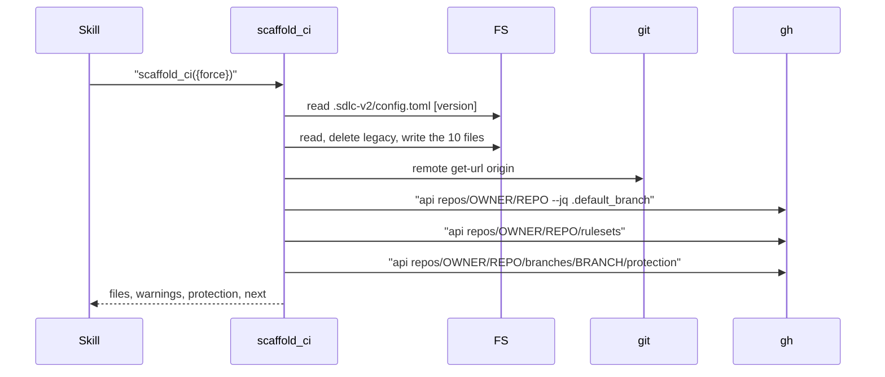

# tool-scaffold-ci Specification

## Purpose
`scaffold_ci` copies the plugin's embedded CI scripts and GitHub workflow files into a user project and reports branch protection that affects release pushes. It is registered as internal to sdlc skills; `setup_write_sections` runs the same scaffold with `force` off after it writes the `version` section, and `validate` action `ci_script_drift` points to it as the fix for drift. Output follows docs/mcp-output-contract.md.

## Requirements

### Requirement: Input and output fields
The tool SHALL accept one input field and return the output fields below.

| Field | Type | Required | Encoding | Meaning |
|---|---|---|---|---|
| `force` | boolean | optional at call time; missing = `false` | `true` or `false` | Overwrite files that already exist and migrate legacy `.js` files |

| Field | Meaning |
|---|---|
| `warnings` | Warning strings; an empty list when there are none |
| `files` | One entry per manifest file, in manifest order: `path`, `action`, `installedVersion`, `currentVersion`, `group` |
| `protection` | Branch protection report: `hasRulesets`, `hasClassicProtection`, `defaultBranch`, `rulesetNames`, `notes` |
| `next` | Next-step guidance (see the guidance requirement) |

- Annotations: `Title: "Scaffold CI workflow files"`, `ReadOnly: false`, `Destructive: true`, `Idempotent: true`, `OpenWorld: true`. `OpenWorld` is `true` because the branch protection check runs `gh api`.

#### Scenario: Force omitted
- **WHEN** the caller passes `{}`
- **THEN** the tool runs with `force: false`
- **AND** the advertised input schema does not list `force` as required

#### Scenario: Fresh project
- **WHEN** the tool runs with `force: false` in a project with no `.github/` files
- **THEN** `files` has 10 entries, each with `action: created`
- **AND** `warnings` is an empty list

### Requirement: File manifest
The tool SHALL install exactly the 10 files below, under the main worktree root, in this order.

| `path` | `group` | Legacy path | Version marker in the file |
|---|---|---|---|
| `.github/scripts/retag-release.cjs` | `retag` | `.github/scripts/retag-release.js` | `const RETAG_SCRIPT_VERSION = N` |
| `.github/workflows/retag-release.yml` | `retag` | none | `# retag-release-version: N` |
| `.github/scripts/check-changelog.cjs` | `changelog` | `.github/scripts/check-changelog.js` | `const CHECK_CHANGELOG_SCRIPT_VERSION = N` |
| `.github/workflows/check-changelog.yml` | `changelog` | none | `# check-changelog-version: N` |
| `.github/scripts/release-on-main.cjs` | `release` | none | `const RELEASE_ON_MAIN_SCRIPT_VERSION = N` |
| `.github/workflows/release-on-main.yml` | `release` | none | `# release-on-main-version: N` |
| `.github/scripts/verify-release-intent.cjs` | `release` | none | `const VERIFY_RELEASE_INTENT_SCRIPT_VERSION = N` |
| `.github/workflows/verify-release-intent.yml` | `release` | none | `# verify-release-intent-version: N` |
| `.github/scripts/promote-release.cjs` | `release` | none | `const PROMOTE_RELEASE_SCRIPT_VERSION = N` |
| `.github/workflows/promote-release.yml` | `release` | none | `# promote-release-version: N` |

- `currentVersion` is the marker number in the embedded file.
- `installedVersion` is the marker number in the file on disk (the new path first, else the legacy path); `null` when neither exists.
- A file with no marker counts as version `1`.

#### Scenario: Files land on disk
- **WHEN** the tool runs in a fresh project
- **THEN** each of the 10 paths exists under the project root

### Requirement: Per-file action
The tool SHALL choose one `action` per manifest file from the table below, and SHALL write the file only for `created`, `overwritten`, and `migrated`.

| New path exists | Legacy path exists | `force` | Installed < current | `action` | Effect |
|---|---|---|---|---|---|
| no | yes | true | any | `migrated` | Delete legacy file, write new file |
| no | yes | false | any | `outdated` | Warning `Legacy file found: <legacy> → use --force to migrate to <path>` |
| no | no | any | n/a | `created` | Write new file (parent folders created) |
| yes | any | true | any | `overwritten` | Write new file |
| yes | any | false | yes | `outdated` | Warning `<path> is outdated (installed: v<I>, current: v<C>). Use --force to update.` |
| yes | any | false | no | `skipped` | None |

#### Scenario: Second run without force skips
- **WHEN** the tool runs twice with `force: false`
- **THEN** every entry of the second run has `action: skipped`

#### Scenario: Second run with force overwrites
- **WHEN** the tool runs once, then again with `force: true`
- **THEN** every entry of the second run has `action: overwritten`

#### Scenario: Legacy file without force
- **WHEN** `.github/scripts/retag-release.js` exists and `.github/scripts/retag-release.cjs` does not, and `force` is `false`
- **THEN** the `.github/scripts/retag-release.cjs` entry has `action: outdated`
- **AND** the legacy file is not deleted

#### Scenario: Legacy file migrated with force
- **WHEN** the same legacy file exists and `force` is `true`
- **THEN** the entry has `action: migrated`
- **AND** `.github/scripts/retag-release.js` is deleted and `.github/scripts/retag-release.cjs` exists

### Requirement: Push-auth secret rewrite
The tool SHALL read `version.pushAuth.secretName` from `.sdlc-v2/config.toml`. When it is set and differs from `RELEASE_TOKEN`, the tool SHALL replace every `secrets.RELEASE_TOKEN` with `secrets.<secretName>` in `release-on-main.yml`, `promote-release.yml`, and `retag-release.yml` before writing them.

- The rewrite does not depend on `version.method`.
- The `secrets.GITHUB_TOKEN` fallback stays in the three files.
- All other files are written unchanged.
- With `secretName` unset or equal to `RELEASE_TOKEN`, all files are byte-identical to the embedded payloads.
- A `[version]` read failure other than "not found" adds warning `reading version config: <cause>` and the run continues without a rewrite.

#### Scenario: Custom secret for any method
- **WHEN** `.sdlc-v2/config.toml` sets `version.method` to `push`, `pr`, or `push-with-secret` and `version.pushAuth.secretName = "MY_BOT"`
- **THEN** the three workflows contain `secrets.MY_BOT` and no `secrets.RELEASE_TOKEN`
- **AND** they still contain `secrets.GITHUB_TOKEN`

#### Scenario: Default secret name leaves payloads unchanged
- **WHEN** `version.pushAuth.secretName` is `RELEASE_TOKEN`
- **THEN** the three workflows are byte-identical to the embedded payloads

### Requirement: Secret name validation
The tool SHALL reject a non-default `version.pushAuth.secretName` that is not a legal GitHub Actions secret name with a `DomainError`, before writing any file.

- Legal: letters, digits, and underscores; does not start with a digit; does not start with `GITHUB_` (any case).

| Condition | Class | Message / Suggestion (short) |
|---|---|---|
| Illegal `secretName` | `DomainError` | `version.pushAuth.secretName "<name>" is not a valid GitHub Actions secret name` / use letters, digits, underscores; fix it in `.sdlc-v2/config.toml`, then run `scaffold_ci` again |

#### Scenario: Illegal secret names are rejected
- **WHEN** `secretName` is one of `1BAD`, `MY-BOT`, `MY BOT`, `GITHUB_BOT`, `a.b`, `x'y`
- **THEN** the result is a `DomainError`
- **AND** `.github/workflows/release-on-main.yml` is not written

### Requirement: Branch protection check
The tool SHALL check the project's default branch for rulesets and classic branch protection after writing files, and SHALL never fail because of this check.

Order of calls in one `scaffold_ci` run:

| Step result | Effect on `protection` |
|---|---|
| No `origin` remote | note `no git remote 'origin' found — skipping branch protection check`; stop |
| Remote URL has no owner/repo | note `could not parse owner/repo from remote "<url>": <cause>`; stop |
| Default-branch `gh api` fails or is empty | note `could not reach GitHub via gh api (is gh installed and authenticated?) — skipping branch protection check`; stop |
| Rulesets call fails | note `could not query repository rulesets (insufficient gh permissions, or none configured)` |
| Rulesets reply is not JSON | note `could not parse rulesets response: <cause>` |
| Rulesets reply is a list | `rulesetNames` = their names; `hasRulesets` = list not empty |
| Protection call succeeds | `hasClassicProtection: true` |
| Either kind found | note `branch protection is active on "<branch>" — release pushes need a token on the ruleset bypass list (see scaffold next steps); tag rulesets need the same bypass entry` |
| Neither found | note `no branch protection detected on "<branch>"` |

- `rulesetNames` and `notes` are empty lists, never null.

#### Scenario: No remote
- **WHEN** the project has no `origin` remote
- **THEN** `protection.defaultBranch` is empty, both flags are `false`, and `notes` has exactly one entry
- **AND** the tool still returns success

#### Scenario: Rulesets and classic protection found
- **WHEN** gh reports default branch `main`, rulesets `main-protection` and `release-guard`, and a protection object for `main`
- **THEN** `hasRulesets` and `hasClassicProtection` are `true` and `rulesetNames` is `["main-protection", "release-guard"]`
- **AND** a note mentions the bypass list

#### Scenario: gh unavailable
- **WHEN** `origin` exists but every gh call fails
- **THEN** `defaultBranch` is empty and a note mentions gh

### Requirement: Next-step guidance
The tool SHALL set `next` from the protection result and the configured secret name. The text SHALL NOT depend on `version.method`.

| Case | `next` contains |
|---|---|
| No protection, no custom secret | `No branch protection detected.` and that both `"push"` and `"pr"` delivery methods will work |
| No protection, custom `secretName` | The above plus `The release workflows read secret <name> first (then fall back to GITHUB_TOKEN)`, the PAT scopes `Contents, Pull requests, Actions`, and the bypass list |
| Protection found | `Branch protection/rulesets detected on "<branch>"`, `GH013`, `Pick one:` with 3 options: GitHub App (`RELEASE_APP_CLIENT_ID`, `RELEASE_APP_PRIVATE_KEY`, bypass list), Admin PAT stored as `secret <secretName or RELEASE_TOKEN>`, and `method = "pr"`; the `~ALL` / `~DEFAULT_BRANCH` status-check advice; link `docs/versioning.md#protected-branches-and-rulesets` |
| Every case | Ends with `promote-release.yml was also scaffolded — use Actions > SDLC Promote Release to promote an RC to a final release without creating a PR.` |

#### Scenario: Protection with no secret configured
- **WHEN** rulesets are found on `main` and `secretName` is unset
- **THEN** `next` contains `secret RELEASE_TOKEN`

#### Scenario: Protection with custom secret
- **WHEN** rulesets are found and `secretName` is `RELEASE_APP_TOKEN`
- **THEN** `next` contains `secret RELEASE_APP_TOKEN`

#### Scenario: Default secret adds no secret note
- **WHEN** no protection is found and `secretName` is `RELEASE_TOKEN`
- **THEN** `next` does not contain `read secret`

### Requirement: Payload content
The tool SHALL install payloads that match this repo's own checked-in `.github/` copies, and whose `.cjs` scripts read only `.sdlc-v2/config.toml`.

- Each embedded payload is byte-identical to the same path under this repo's `.github/`.
- No written `.cjs` file references `.sdlc-v2/config.json`, `.sdlc/config.json`, or `.claude/sdlc.json`.

#### Scenario: Written scripts read the TOML config only
- **WHEN** the tool runs in a fresh project
- **THEN** each of the 5 written `.cjs` files contains `.sdlc-v2/config.toml`
- **AND** none contains `.sdlc/config.json` or `.claude/sdlc.json`

### Requirement: Infrastructure errors
The tool SHALL stop and return an `InfraError` on the file-system failures below. Files written before the failure stay on disk.

| Condition | Class | Message / Suggestion (short) |
|---|---|---|
| Project root cannot be resolved | `InfraError` | `resolve project root: <cause>` / run `git worktree list --porcelain`, fix, retry |
| Embedded payload missing | `InfraError` | `embedded payload "<name>" not found` / update or reinstall the plugin |
| Installed file cannot be read | `InfraError` | `check installed version of CI script <path>: read <file>: <cause>` / check read permission |
| Legacy file cannot be deleted | `InfraError` | `remove legacy <file>: <cause>` / delete it by hand, rerun with `force: true` |
| Folder cannot be created | `InfraError` | `mkdir <dir>: <cause>` / remove the blocking file, make the parent writable |
| File cannot be written | `InfraError` | `write <file>: <cause>` / check write permission and disk space |

#### Scenario: Unwritable destination
- **WHEN** a destination file cannot be written
- **THEN** the result is an `InfraError` whose message starts with `write `
