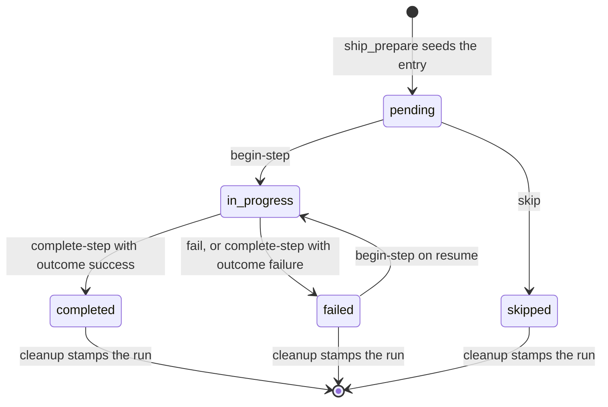

# tool-ship-state Specification

## Purpose
MCP tool `ship_state` reads and updates the ship pipeline's run state: step lifecycle, decisions, deferred findings, self-healing records, resume data, cleanup, garbage collection, the end-of-run report, and the durable history store. The `ship` skill and its sub-skills (`received-review`, `harden`, `deferred`) call it throughout a run. Output follows docs/mcp-output-contract.md.

## Requirements

### Requirement: Action dispatch
The tool SHALL select one operation from the `action` input and SHALL return a `DomainError` that lists every accepted action when `action` is unknown.

| Action | Group | Writes |
|---|---|---|
| `begin-step` | step lifecycle | ship state file |
| `complete-step` | step lifecycle | ship state file, `.sdlc-v2/timings.json` |
| `skip` | step lifecycle | ship state file |
| `fail` | step lifecycle | ship state file |
| `start` | step lifecycle (legacy alias of `begin-step`) | ship state file |
| `complete` | step lifecycle (legacy alias of `complete-step`) | ship state file, `.sdlc-v2/timings.json` |
| `decide` | run records | ship state file |
| `defer` | run records | ship state file, `.sdlc-v2/history/deferred.json` |
| `healing_record` | run records | ship state file |
| `harden_clusters` | query | nothing |
| `read` | query | nothing |
| `next` | query | nothing |
| `todos` | query | nothing |
| `report` | end of run | `.sdlc-v2/reports/` when `detail.write` is `true` |
| `cleanup` | end of run | ship state file (stamp) |
| `cleanup-pipeline` | end of run | ship state file (stamp), deletes stale state files and run directories |
| `gc` | housekeeping | deletes stale state files unless `detail.dryRun` |
| `init` | housekeeping (legacy) | new ship state file |
| `migrate` | housekeeping | renames state files |
| `history_record` | history store | `.sdlc-v2/history/runs.jsonl` |
| `deferred_add` | history store | `.sdlc-v2/history/deferred.json` |
| `deferred_list` | history store | nothing |
| `deferred_propose_followups` | history store | nothing |
| `deferred_resolve` | history store | `.sdlc-v2/history/deferred.json` |
| `log-cli` | evidence | `.sdlc-v2/evidence/cli-executions.jsonl` |

#### Scenario: Unknown action
- **WHEN** the call passes `action:"bogus"`
- **THEN** the tool returns a `DomainError`
- **AND** the suggestion names every action in the table

### Requirement: Common inputs and state lookup
The tool SHALL resolve the ship state file for `detail.branch`, or for the current git branch when `detail.branch` is absent, as the newest `.sdlc-v2/runs/ship-<branch-slug>-<timestamp>.json` under the main worktree root.

| Field | Type | Required | Encoding | Meaning |
|---|---|---|---|---|
| `action` | string | yes | enum, see the actions table | Operation to run. |
| `step` | string | for `begin-step`, `complete-step`, `start`, `complete`, `skip`, `fail`, `decide` | plain text, e.g. `"review"` | Step name. |
| `detail` | object | no | JSON object, e.g. `{"branch":"feat/x"}` | Action-specific fields; all action parameters travel here. |
| `sessionId` | string | no | plain text | Stamped into the state by `init`. |
| `detail.branch` | string | no | plain text branch name | Branch whose state to use. |
| `detail.stateFile` | string | no | absolute path | Read this file directly. Honored only by `begin-step`, `complete-step`, `next`, `todos`. |

| Condition | Class | Message / Suggestion (short) |
|---|---|---|
| Required `step` missing | `DomainError` | `<action>: step is required` |
| Branch cannot be resolved | `DomainError` | `could not determine branch: ...` / pass the branch explicitly |
| No state file for the branch | `DataError` | `no ship state found for branch "<b>"` |
| `step` not in the state's `steps[]` | `DataError` | `step "<s>" not found in state` / run `read` for valid names |
| `detail.stateFile` does not exist | `DataError` | `state file not found: <path>` |
| `detail.stateFile` is not valid JSON | `DomainError` | `failed to parse state file <path>: ...` |
| `detail.stateFile` cannot be read | `InfraError` | `read state file <path>: ...` |
| State file write fails | `InfraError` | `write ship state to <path>: ...` |

- Every input-validation message starts with the action name.
- A failed `step` lookup leaves the state file unchanged.
- The branch slug must match exactly: a file for a branch whose slug only starts with this slug (e.g. `feat-x-2` for `feat-x`) is never used.

#### Scenario: Other branch with a longer slug
- **WHEN** only `ship-feat-errs-2-20260101T000000Z.json` exists
- **AND** the call passes `action:"read"` with `detail.branch:"feat/errs"`
- **THEN** the tool returns a `DataError` `no ship state found for branch "feat/errs"`

#### Scenario: Step missing
- **WHEN** the call passes `action:"skip"` with no `step`
- **THEN** the tool returns a `DomainError` naming the `step` field

#### Scenario: No state for branch
- **WHEN** the call passes `action:"read"` and `detail.branch:"feat/none"` has no state file
- **THEN** the tool returns a `DataError` whose message names `feat/none`

#### Scenario: stateFile bypasses branch lookup
- **WHEN** the call passes `action:"next"` and `detail.stateFile` pointing at a valid state file
- **THEN** the tool reads that file without resolving a branch

#### Scenario: Unknown step name
- **WHEN** the call passes `action:"begin-step"` and `step:"bogus"`
- **THEN** the tool returns a `DataError` naming `bogus`
- **AND** the state file bytes are unchanged

### Requirement: Repeated step names
When a step name occurs more than once in `steps[]`, `begin-step`, `complete-step`, `start`, `complete`, `skip` and `fail` SHALL act on one entry with that name, selected as the table says.

| Entries with the name | Selected entry |
|---|---|
| At least one is not `completed` or `skipped` | The first such entry |
| All are `completed` or `skipped` | The first entry with the name |

- The `<pos>` in the narration `summary` is the position of the selected entry, taken before the action changes its status.
- The journal key of the selected entry is `<step>` for the first entry with the name and `<step>#<n>` for the n-th entry (n ≥ 2).

#### Scenario: Skip the second commit
- **WHEN** `steps[]` is `commit`, `harden`, `commit`, `pr`, the first `commit` and `harden` are `completed`, and the call passes `action:"skip"` with `step:"commit"`
- **THEN** the third entry is `skipped`
- **AND** the first entry is still `completed` with its old `result` and `completedAt`
- **AND** `summary` is `Step 'commit' skipped (3 of 4).`

#### Scenario: Retry of a failed first commit
- **WHEN** `steps[]` is `commit`, `harden`, `commit`, the first `commit` is `failed`, and the call passes `action:"begin-step"` with `step:"commit"`
- **THEN** the first entry is `in_progress`
- **AND** the third entry is still `pending`

### Requirement: Behavior with no ship state
The tool SHALL handle a branch with no ship state file per action as follows.

| Action | Result with no state file |
|---|---|
| `begin-step`, `complete-step`, `start`, `complete`, `skip`, `fail`, `decide`, `read`, `next`, `todos`, `report` | `DataError` naming the branch |
| `defer` | Succeeds; records the finding only in `.sdlc-v2/history/deferred.json` |
| `healing_record` | Succeeds with `written:false`; writes nothing |
| `harden_clusters` | Succeeds; every cluster has `alreadyHardened:false` |
| `cleanup` | Succeeds with an empty result |
| `cleanup-pipeline` | Succeeds with `currentRun.reason:"no-state-file"`; still runs the GC sweep |

#### Scenario: defer without state
- **WHEN** the call passes `action:"defer"` with valid fields on a branch with no state file
- **THEN** the call succeeds
- **AND** no run-scoped entry is written

### Requirement: Step lifecycle
The tool SHALL move a `steps[]` entry between `pending`, `in_progress`, `completed`, `skipped`, and `failed` only through the lifecycle actions, and SHALL NOT check the target step's own current status before changing it.

Status transitions of one `steps[]` entry:



| Action | New `status` | Fields set |
|---|---|---|
| `begin-step`, `start` | `in_progress` | `startedAt` |
| `complete-step` (outcome `success`), `complete` | `completed` | `completedAt`; `result` when `detail.result` is present |
| `complete-step` (outcome `failure`) | `failed` | `error` from `detail.result` when present; no `completedAt` |
| `skip` | `skipped` | `completedAt`; `reason` when `detail.reason` is present |
| `fail` | `failed` | `error` when `detail.error` is present; no `completedAt` |

- `decide` never changes any `steps[]` entry.

#### Scenario: Failure outcome stores result as error
- **WHEN** the call passes `action:"complete-step"`, `detail.outcome:"failure"`, and `detail.result:"boom"`
- **THEN** the step's `status` is `failed` and its `error` is `"boom"`

#### Scenario: Retry after failure
- **WHEN** a step is `failed` and the call passes `action:"begin-step"` for it
- **THEN** the step's `status` becomes `in_progress`

### Requirement: Proceed gate on begin-step
The `begin-step` action SHALL return a `DomainError` when any earlier entry in `steps[]` blocks progress.

- A `pending` entry blocks unless it has a `condition` key.
- An `in_progress` or `failed` entry always blocks.
- A `completed` or `skipped` entry never blocks.
- Message: `cannot begin step "<s>" — prior step(s) not terminal-OK: <name>=<status>, ...; complete or skip the blocking step(s) first`.
- The legacy `start` action has no gate.

#### Scenario: Pending predecessor blocks
- **WHEN** `execute` is `pending` without `condition` and the call begins `commit`
- **THEN** the tool returns a `DomainError` naming `execute=pending`

#### Scenario: Skipped predecessor
- **WHEN** `execute` is `skipped` and the call begins `commit`
- **THEN** `commit` becomes `in_progress`

#### Scenario: Conditional pending predecessor
- **WHEN** an earlier entry is `pending` with a `condition` key
- **THEN** it does not block `begin-step`

#### Scenario: Failed predecessor blocks
- **WHEN** `execute` is `failed` and the call begins `commit`
- **THEN** the tool returns a `DomainError` naming `execute=failed`

### Requirement: Step narration output
The lifecycle actions and `decide`/`defer` SHALL return a narration whose fields depend on the action, as the table says.

| Field | Meaning |
|---|---|
| `summary` | One line, e.g. `Step '<s>' started (<pos> of <total>).`, `Step '<s>' completed in <dur> (<pos> of <total>).`, `Step '<s>' failed (<pos> of <total>).`, `Step '<s>' skipped (<pos> of <total>).`, `Decision recorded for step '<s>'.` |
| `display` | Markdown progress block of every step. All these actions; see the detail-level requirement. `defer` with no state file never returns it. |
| `timing` | `{stepSeconds, pipelineSeconds, idleSeconds, human}`; `complete-step`/`complete` only, when computable. |
| `next` | `{id, instruction, etaSeconds, etaBasis}`; `begin-step`, `complete-step`, `start`, `complete` only. `instruction` is `Dispatch the <step> sub-skill.` |
| `todos` | `begin-step`/`complete-step` only: task list (see `todos`). |
| `alreadyDone` | `begin-step` only: `true` when the journal entry of the selected step entry exists in the state (`sideEffects.<step>`, or `sideEffects.<step>#<n>` for a repeated name). |
| `issueCount`, `issueHighlights` | `complete-step` only, when `issues[]` is non-empty: total count and the last 5 issues as `[severity] summary` lines. |

- `begin-step`'s `next.id` is the step it began.
- `complete-step`'s `next` is the first blocking step; it is absent when no step blocks.
- `etaSeconds`/`etaBasis` appear when `.sdlc-v2/timings.json` has samples for `ship:<step>`.

#### Scenario: alreadyDone from journal
- **WHEN** the state holds `sideEffects.pr` and the call begins `pr`
- **THEN** `alreadyDone` is `true`

#### Scenario: Second commit not done by the first commit's journal entry
- **WHEN** `steps[]` has `commit` twice, the first is `completed`, the state holds only `sideEffects.commit`, and the call begins `commit`
- **THEN** `alreadyDone` is `false`

#### Scenario: No next at pipeline end
- **WHEN** `complete-step` finishes the last blocking step
- **THEN** `next` is absent

### Requirement: Step timing records
On `complete-step` and `complete`, the tool SHALL record the step's duration in `.sdlc-v2/timings.json` under key `ship:<step>`, except for `await-remote-review`.

#### Scenario: Duration recorded
- **WHEN** `review` completes with both `startedAt` and `completedAt` set
- **THEN** `.sdlc-v2/timings.json` holds a sample under `ship:review`

#### Scenario: Human wait step not recorded
- **WHEN** `await-remote-review` completes
- **THEN** no sample is recorded under `ship:await-remote-review`

### Requirement: complete-step outcome input
The `complete-step` action SHALL accept `detail.outcome` of `"success"` (default) or `"failure"` and SHALL return a `DomainError` for any other value.

- Message: `complete-step: outcome must be "success" or "failure", got <value>`.

#### Scenario: Invalid outcome
- **WHEN** the call passes `detail.outcome:"done"`
- **THEN** the tool returns a `DomainError`

### Requirement: fail records an issue
The `fail` action SHALL set `lastFailedStep` to the step name and append one entry to `issues[]`.

```text
{step:<s>, severity:"error", category:"ship-fail", summary:"Step <s> failed", detail:<detail.error as text>, timestamp:<RFC3339 UTC>}
```

- Only `detail.error` is read; a non-string `detail.error` is stored as given and rendered as text in `detail`.
- A state file with no `issues` key gets one.

#### Scenario: Fail appends issue
- **WHEN** the call passes `action:"fail"`, `step:"review"`, `detail.error:"timeout"`
- **THEN** `lastFailedStep` is `"review"`
- **AND** `issues[]` ends with `{step:"review", severity:"error", category:"ship-fail", summary:"Step review failed", detail:"timeout"}`

### Requirement: Narration detail level
For `begin-step`, `complete-step`, `start`, `complete`, `skip`, `fail`, `decide`, and `defer`, the tool SHALL accept `detail.detail` of `"full"` (default) or `"concise"`, and SHALL return a `DomainError` for any other string.

- `"concise"` omits `display` on `skip`, `fail`, `decide`, `defer`.
- `begin-step`, `complete-step`, `start`, `complete` always include `display`.

#### Scenario: Concise skip
- **WHEN** the call passes `action:"skip"` with `detail.detail:"concise"`
- **THEN** the response has no `display`

#### Scenario: Invalid detail level
- **WHEN** the call passes `detail.detail:"verbose"`
- **THEN** the tool returns a `DomainError`

### Requirement: decide
The `decide` action SHALL append `{step, decision, at}` to `decisions[]`, with `decision` taken from `detail.text` and `at` set to the call time (RFC 3339 UTC), without checking `step` against `steps[]`.

#### Scenario: Decision for a step with no entry
- **WHEN** the call passes `action:"decide"`, `step:"received-review"`, `detail.text:"fixed 3"`
- **THEN** `decisions[]` ends with `{step:"received-review", decision:"fixed 3", at:<now>}`

### Requirement: defer
The `defer` action SHALL record one deferred finding in the run's `deferredFindings[]` and in `.sdlc-v2/history/deferred.json`, and SHALL name the generated id in `summary`.

| Field | Type | Required | Encoding | Meaning |
|---|---|---|---|---|
| `detail.severity` | string | yes | `critical` \| `high` \| `medium` \| `low` \| `info`, case-insensitive | Stored lowercase. |
| `detail.file` | string | yes | plain text path | Finding's file. |
| `detail.title` | string | yes | plain text | Finding's title. |
| `detail.line` | int | no | JSON integer | Finding's line. |
| `detail.reason` | string | no | `below-threshold` \| `needs-direction` \| `disagree` \| `wont-fix` | Defaults to `below-threshold`. |
| `detail.description` | string | no | plain text | Deferring agent's reasoning. Defaults to `title`. |
| `detail.source` | string | no | plain text, e.g. `"received-review"` | Defaults to `review-below-threshold`. |

- Run entry: `{severity, file, line, title, reason, description}`.
- History entry: `{id, created, source, priority, description, status:"open", severity, file, line, reason}`.
- `id` is `review-deferred-<RFC3339 timestamp>-<N>`; `N` is the run's deferred count after this entry, or the history entry count plus 1 with no state file.
- `priority`: `critical`/`high` → `high`; `medium` → `medium`; `low`/`info` → `low`.
- A history entry with the same `id` already present is not written again.
- Success appends ` Written to <path>.` to `summary`.
- A failed history write does not fail the call; `summary` appends a `WARNING: could not persist this item to .sdlc-v2/history/deferred.json (...)` sentence that names the `deferred_add` recovery call with `detail.id` and `detail.description`, and says not to repeat the original call.
- A JSON `null` value counts as omitted.

| Condition | Class | Message (short) |
|---|---|---|
| `severity`, `file`, or `title` missing or empty | `DomainError` | `defer: severity, file, and title are required` |
| Unknown severity | `DomainError` | `defer: detail.severity "<s>" is not a recognised review severity — accepted values are critical \| high \| medium \| low \| info` |
| Unknown reason | `DomainError` | `defer: detail.reason "<r>" is not a recognised deferral reason — accepted values are below-threshold \| needs-direction \| disagree \| wont-fix` |
| `reason`, `description`, or `source` not a string | `DomainError` | `defer: detail.<key> must be a string, got <type>` |
| `line` not an integer | `DomainError` | `defer: detail.line must be an integer, got <type>` |
| History list fails with no state file | `InfraError` | `list deferred issues: ...` |

#### Scenario: Deferred with defaults
- **WHEN** the call passes `detail:{severity:"LOW", file:"a.go", title:"t"}` on a branch with state
- **THEN** the run entry has `severity:"low"`, `reason:"below-threshold"`, `description:"t"`
- **AND** `.sdlc-v2/history/deferred.json` gains an open entry with `source:"review-below-threshold"` and `priority:"low"`

#### Scenario: Source override
- **WHEN** the call passes `detail.source:"received-review"`
- **THEN** the history entry's `source` is `"received-review"`

#### Scenario: Persist failure named
- **WHEN** the history write fails
- **THEN** the call succeeds
- **AND** `summary` contains `WARNING: could not persist this item` and `deferred_add`

### Requirement: healing_record
The `healing_record` action SHALL validate one record of `detail.kind` `review-total`, `fixed`, or `hardened`, and SHALL write it to the live run's `healing` object.

| `detail.kind` | Required fields | Write rule |
|---|---|---|
| `review-total` | `total`, `dimensions` (non-negative integers) | Replaces `healing.reviewTotal`. |
| `fixed` | `origin` (`local-review` \| `pr-comment`), `severity` (review severity, stored lowercase), `file`, `title`; optional integer `line` | Appends to `healing.fixed`; a record with the same `(origin, file, line, title)` is a duplicate. |
| `hardened` | `phase` (`started` \| `done`), `trigger`, `classification`, `applied` (array of `{surface, action, targetFile}`, may be empty), `skipped` (non-negative integer) | Upserts `healing.hardened` by `trigger`: `done` replaces a stored `started`; any other repeat is a duplicate. |

- `applied[].surface` is one of `plan-guardrails`, `execute-guardrails`, `review-dimensions`, `copilot-instructions`, `error-report-skill`, `skill-recommendation`.
- Each record gets `recordedAt`.
- Input is validated before the state lookup.
- With no state file, or a state with `pipelineCompletedAt` set, the call succeeds and writes nothing.

| Output field | Meaning |
|---|---|
| `summary` | `healing_record <kind>: <narration>`; narration is `recorded`, `replaced started record`, `already recorded — no change`, or `no live ship run on this branch — healing not recorded`. |
| `kind` | The kind. |
| `written` | `true` only when this call changed the state file. |
| `record` | The validated record as persisted, `recordedAt` included. |

| Condition | Class | Message (short) |
|---|---|---|
| `kind` missing | `DomainError` | `healing_record: detail.kind is required — accepted values are review-total \| fixed \| hardened` |
| Unknown `kind`, `origin`, `severity`, or `phase` | `DomainError` | `healing_record: detail.<field> "<v>" is not a recognised ... — accepted values are ...` |
| Unknown `applied[].surface` | `DomainError` | `healing_record: detail.applied[<i>].surface "<s>" is not a harden surface id — accepted values are ...` |
| Required field missing | `DomainError` | `healing_record: detail.<field> is required for kind "<kind>"` |
| Integer field negative or fractional | `DomainError` | `healing_record: detail.<field> must be a non-negative integer, got ...` |

#### Scenario: Fixed duplicate
- **WHEN** the same `fixed` record is sent twice
- **THEN** the second response has `written:false` and narration `already recorded — no change`

#### Scenario: Hardened done replaces started
- **WHEN** a `started` record exists for trigger `T` and a `done` record for `T` is sent
- **THEN** narration is `replaced started record` and `healing.hardened` has one entry for `T`

#### Scenario: No live run
- **WHEN** the state has `pipelineCompletedAt` set
- **THEN** the call succeeds with `written:false` and narration `no live ship run on this branch — healing not recorded`

### Requirement: harden_clusters
The `harden_clusters` action SHALL group `detail.findings` into at most 5 clusters keyed by file, without writing any state.

| Field | Type | Required | Encoding | Meaning |
|---|---|---|---|---|
| `detail.findings[].file` | string | yes | non-empty path | Cluster key. |
| `detail.findings[].severity` | string | yes | review severity, case-insensitive | Stored lowercase. |
| `detail.findings[].verdict` | string | yes | `agree-will-fix` \| `agree-won't-fix` \| `disagree` \| `needs-direction` | Reviewer verdict. |
| `detail.findings[].title`, `.body` | string | no | plain text | Rendered into `failureText`. |
| `detail.findings[].reason` | string | no | deferral reason | `below-threshold` drops the finding. |

- Findings with `reason:"below-threshold"` are dropped.
- A file whose only finding is a disagree (`verdict:"disagree"` or `reason:"disagree"`) goes to `loneDisagree`.
- Clusters sort by finding count (most first), then file path; files past the fifth go to `suppressed`, sorted.
- `failureText` is `[<severity>] <title> — <verdict>\n<body>` per finding, joined by a blank line; every `"` becomes `'` and every `\` becomes `/`; capped at 4096 characters.
- `alreadyHardened` is `true` when `failureText` equals a `healing.hardened[].trigger` of either phase in the branch's state after each is trimmed of surrounding white space, capped at 200 characters, and trimmed again.
- `dirtySurfaces` lists which of `.sdlc-v2/config.toml`, `.sdlc-v2/review-dimensions`, `.github/instructions` have uncommitted changes in the active worktree (`git status --porcelain`).

| Output field | Meaning |
|---|---|
| `clusters` | `[{key, findings, failureText, alreadyHardened}]` |
| `suppressed`, `loneDisagree`, `dirtySurfaces` | Path lists; `[]` never `null`. |
| `narration` | `harden_clusters: <n> cluster(s), <s> suppressed, <l> lone-disagree file(s), <d> dirty surface(s).` |
| `next` | `no clusters — skip`, `all clusters already hardened — commit leftover edits`, or `dispatch <n> cluster(s) with alreadyHardened:false, one at a time` |

| Condition | Class | Message (short) |
|---|---|---|
| `findings` missing or not an array | `DomainError` | `harden_clusters: detail.findings is required` / `must be an array` |
| Bad finding field | `DomainError` | `harden_clusters: detail.findings[<i>].<field> ...` |
| `git status` fails | `DomainError` | `harden_clusters: git status failed: ...` |

#### Scenario: Trigger without the trailing newline
- **WHEN** a finding has an empty `body`, so its `failureText` ends with a newline
- **AND** the state holds a `healing.hardened[].trigger` equal to that text without the newline
- **THEN** the cluster has `alreadyHardened:true`

#### Scenario: Quote-safe failure text
- **WHEN** a finding title contains `"` and `\`
- **THEN** `failureText` contains `'` and `/` in their place

#### Scenario: Cap at five
- **WHEN** findings span 6 files with 1 finding each
- **THEN** `clusters` has 5 entries in alphabetical order
- **AND** `suppressed` holds the sixth file

#### Scenario: Git status failure
- **WHEN** `git status --porcelain` fails
- **THEN** the tool returns a `DomainError`, never an empty `dirtySurfaces`

#### Scenario: First status line keeps its status column
- **WHEN** the only change in the active worktree is an unstaged edit to tracked `.sdlc-v2/config.toml`, so `git status --porcelain` prints ` M .sdlc-v2/config.toml` as its first line
- **THEN** `dirtySurfaces` is `[".sdlc-v2/config.toml"]`

### Requirement: read returns state and report data
The `read` action SHALL return the full state object plus a computed `reportData` object, and SHALL NOT modify the state file.

| `reportData` field | Meaning |
|---|---|
| `version` | Always `""`. |
| `bump`, `bumpSource` | `flags.bump` and `sources.bump`. |
| `preRelease`, `preReleasePolicy` | From the state's `versionCfg`; omitted when empty. |
| `stepsTotal`, `stepsCompleted`, `stepsSkipped`, `stepsFailed` | Counts over `steps[]`. |
| `stepsPending` | Count of every other status, `in_progress` included. |
| `duration` | Humanized `startedAt` → `pipelineCompletedAt`, or → now. |
| `decisions` | `"<step>: <decision>"` strings. |
| `deferredFindings` | Count of `deferredFindings[]`. |
| `binaryVersion` | String fields of the state's `binaryVersion`. |
| `reviewLedger` | `{total, fixed, deferredByReason, unaccounted}` or `null`. |
| `reviewLedgerNote` | `review did not run or its total was not recorded`; only when `reviewLedger` is `null`. |
| `healing` | The state's `healing` object, or `{}`. |

- `reviewLedger.total` is `healing.reviewTotal.total`; `null` when that is not an integer.
- `reviewLedger.fixed` counts only `healing.fixed` records with `origin:"local-review"`.
- `reviewLedger.deferredByReason` counts `deferredFindings[]` by `reason`; a missing reason counts as `below-threshold`.
- `reviewLedger.unaccounted` is `total - fixed - deferred` and is never clamped.

#### Scenario: Ledger with a negative gap
- **WHEN** `reviewTotal.total` is 2, one `local-review` fix and two deferrals exist
- **THEN** `reviewLedger.unaccounted` is `-1`

#### Scenario: No review total
- **WHEN** no `review-total` record exists
- **THEN** `reportData.reviewLedger` is `null`
- **AND** `reportData.reviewLedgerNote` is `review did not run or its total was not recorded`

### Requirement: read attaches a resume briefing
The `read` action SHALL attach `resumeBriefing` when the run is not stamped `pipelineStatus:"completed"`, some step blocks progress, and at least one step has started.

- "Blocks" uses the proceed-gate rule: `pending` without `condition`, `in_progress`, or `failed`.
- The last step is the `in_progress` entry, else the last entry with `startedAt`.
- A `failed` last step still reports `resumable:true`; `read` never errors for it.
- A freshly initialized run (nothing started) has no `resumeBriefing`.
- A run stamped `pipelineStatus:"completed"` has no `resumeBriefing`, even when a step ended `failed`.

| Field | Meaning |
|---|---|
| `resumable` | Always `true`. |
| `lastStep`, `lastStepStatus` | Name and status of the last step. |
| `sideEffects` | Sorted `"<step> (<kind>): <ref>"` lines from `sideEffects`; `sha` refs shortened to 7 characters; `[]` when none. |
| `summary` | `Run resumable: last step "<s>" (<status>), interrupted <duration> ago.` |
| `display` | Markdown block starting `**Resume briefing**`. |
| `timing` | `{stepSeconds, pipelineSeconds, idleSeconds, human}`; idle time counts from the last step's `completedAt`, else its `startedAt`. |
| `next` | `{id, instruction, etaSeconds, etaBasis}` for the first blocking step. |

#### Scenario: Failed step is resumable
- **WHEN** `execute` is `failed` with `startedAt` 5 minutes ago and `sideEffects.execute` holds a 40-char sha
- **THEN** `resumeBriefing.resumable` is `true` and `lastStepStatus` is `"failed"`
- **AND** `timing.stepSeconds` and `timing.idleSeconds` are `300`
- **AND** `sideEffects` has one entry with the sha shortened to 7 characters

#### Scenario: Fresh run has no briefing
- **WHEN** every step is `pending` with no `startedAt`
- **THEN** the response has no `resumeBriefing`

#### Scenario: Completed run has no briefing
- **WHEN** `execute` is `failed` with a `startedAt`, every other step is `skipped`, and `cleanup` stamped the run `pipelineStatus:"completed"`
- **THEN** the response has no `resumeBriefing`

### Requirement: next
The `next` action SHALL return the first `steps[]` entry that blocks progress as `step`, with its automation mode as `automation`.

- `automation` is the config `automation.steps.<step>` value when set; else `"auto"` under `automation.mode = "unattended"`; else `"confirm"`.
- A config read failure or a missing `automation` section yields `"confirm"`.
- When no step blocks, the result has neither `step` nor `automation`.
- Entries that are not objects are skipped.

#### Scenario: Unattended mode
- **WHEN** `.sdlc-v2/local.toml` sets `[automation] mode = "unattended"`
- **THEN** `automation` is `"auto"`

#### Scenario: Pipeline complete
- **WHEN** every entry is `completed`, `skipped`, or conditional `pending`
- **THEN** the result has no `step`

### Requirement: todos
The `todos` action SHALL return a task list built from `flags.steps` plus a trailing `cleanup` entry, with each step expanded into fixed sub-step items.

- Item `content` is `<Step name with dashes as spaces, first letter upper>: <sub-step>`; `activeForm` is the sub-step with its first letter upper.
- A `completed` step's items are `completed`; `skipped` and `failed` steps are also `completed`, with ` (skipped)` or ` (failed)` appended to `content`.
- For the `step` input, the first item is `in_progress` and the rest are `pending`, unless that step is already terminal.
- Any other `in_progress` step's items are `in_progress`; everything else is `pending`.
- Only names in `flags.steps`, plus `cleanup`, appear.

#### Scenario: Current step
- **WHEN** the call passes `action:"todos"`, `step:"execute"`, and `execute` is `in_progress`
- **THEN** the first `Execute:` item is `in_progress`

### Requirement: cleanup
The `cleanup` action SHALL validate that no `steps[]` entry is `in_progress` or `pending` without `condition`, then stamp `pipelineStatus:"completed"` and `pipelineCompletedAt` and keep the file.

- Success returns `{valid:true, cleaned:true, pipelineStatus:"completed", pipelineCompletedAt}`.
- `failed` entries never violate the contract.
- A violation returns a `DataError` and leaves the file untouched: `pipeline contract violation: <n> step(s) not in terminal state (<name>=<status>, ...) — state file preserved`.

#### Scenario: Valid stamp
- **WHEN** every entry is `completed`, `skipped`, or `failed`
- **THEN** the state file still exists with `pipelineStatus:"completed"`

#### Scenario: Violation preserves file
- **WHEN** an entry is `in_progress`
- **THEN** the tool returns a `DataError` and the file is unchanged

### Requirement: cleanup-pipeline
The `cleanup-pipeline` action SHALL settle the current run, delete the plan run linked to this ship run, then run a GC sweep and a per-run-directory reap, unless the contract check fails.

| Path | `currentRun` |
|---|---|
| `detail.force:true` | `{cleaned:false, preservedReason:"force"}`; no check, no stamp |
| No state file | `{valid:true, cleaned:false, reason:"no-state-file"}` |
| Valid contract | `{valid:true, cleaned:true, pipelineStatus:"completed", pipelineCompletedAt}`; file stamped |
| Violation | `DataError` as in `cleanup`; no sweep runs |

| Output field | Meaning |
|---|---|
| `currentRun` | See the table above. |
| `planRun` | `{deleted: true, runId}` when the linked plan run and its `.evidence/` dir were deleted; `{deleted: false, reason}` otherwise (`run not stamped`, `no linked plan run`, `report not written`, `remove failed: <error>`). |
| `gc` | `{ship, execute, plan, commit}`, each `{deleted, kept}`. |
| `directories` | Reap result for stale per-run directories under `.sdlc-v2/runs/`. |
| `force`, `ttlDays` | Resolved inputs. TTL: `detail.ttlDays` > config `state.gc.ttlDays` > `7`. |
| `issueSummary` | `{total, byCategory, items, display, hardenSuggestion?}`; only after a stamp, and only when `issues[]` is non-empty. |

- The linked plan run is the plan run whose `planFilePath` equals the execute state's `planPath`.
- The linked plan run is deleted only after the stamp and only when this run's report file `.sdlc-v2/reports/ship-<runId>-report.<md|json>` exists; otherwise it is left for GC.

| Condition | Class | Message (short) |
|---|---|---|
| `detail.force` not a boolean | `DomainError` | `cleanup-pipeline: detail.force must be a boolean, got <type>` |
| Sweep fails after a stamp | `InfraError` | `run is already marked completed; only the gc sweep over <dir> failed: ...` / call `ship_state gc` to retry the sweep |
| Sweep fails without a stamp | `InfraError` | `gc sweep over <dir>: ...` |

#### Scenario: Force preserves the run
- **WHEN** the call passes `detail.force:true` with an `in_progress` step
- **THEN** `currentRun` is `{cleaned:false, preservedReason:"force"}`
- **AND** the state file is not stamped
- **AND** `planRun` is `{deleted:false, reason:"run not stamped"}` — force never stamps, so the linked plan run is always left for GC

#### Scenario: Issue summary after stamp
- **WHEN** the run stamps and `issues[]` has entries
- **THEN** the response has `issueSummary`

#### Scenario: No issues
- **WHEN** the run stamps and `issues[]` is empty
- **THEN** the response has no `issueSummary`

#### Scenario: Plan run deleted after the report
- **WHEN** the report was written and the run stamps
- **THEN** the linked `plan-<slug>-<ts>.json` and its `.evidence/` dir are deleted
- **AND** `planRun.deleted` is `true`

#### Scenario: Report not written
- **WHEN** the run stamps but no report was written
- **THEN** the linked plan run is kept
- **AND** `planRun` is `{deleted:false, reason:"report not written"}`

### Requirement: gc
The `gc` action SHALL prune stale state files, or with `detail.dryRun:true` only classify them, and a dry run SHALL list in `wouldDelete` exactly the files a real run with the same inputs deletes.

- TTL: `detail.ttlDays` > config `state.gc.ttlDays` (integer ≥ 0) > `7`; `0` is literal.
- Real run returns `{ttlDays, ship, execute, plan, commit}`, each `{deleted, kept}`; explore tempdirs are also swept but not reported.
- Dry run returns `{dryRun:true, ttlDays, ship, execute, plan}`, each `{wouldDelete, wouldKeep}` of `{file, branch, reason}`; `commit` files are not classified.
- Both runs use one rule per file. Every file of a gone branch is deleted, whatever its age. A live branch keeps its newest file (per prefix) and every file within the TTL; its older files past the TTL are deleted.

| Branch | File | Result | Dry-run `reason` |
|---|---|---|---|
| gone | within TTL | delete | `branch-gone` |
| gone | past TTL | delete | `stale+branch-gone` |
| live | within TTL | keep | `ttl-fresh` |
| live | newest, past TTL | keep | `branch-exists` |
| live | older, past TTL | delete | `stale+superseded` |

- When `git branch --list` fails, or lists no branch at all, every branch counts as live (real run and dry run).
- `detail.dryRun` that is not a boolean returns a `DomainError` (`gc: detail.dryRun must be a boolean, got <type>`); a top-level `dryRun` is ignored.

#### Scenario: Mistyped dryRun
- **WHEN** the call passes `detail.dryRun:"true"`
- **THEN** the tool returns a `DomainError` and deletes nothing

#### Scenario: Dry run matches the real run
- **WHEN** a gone branch has a state file within the TTL and a live branch has an older state file past the TTL next to a newer one
- **THEN** a dry run lists both files in `wouldDelete`, with reasons `branch-gone` and `stale+superseded`
- **AND** the real run that follows deletes exactly the files the dry run listed

#### Scenario: Dry run skips commit files
- **WHEN** a stale `commit-*.json` file exists and the call passes `detail.dryRun:true`
- **THEN** the result has no `commit` bucket

### Requirement: init (legacy)
The `init` action SHALL create a new ship state file with the fixed legacy scaffold and delete other ship state files for the same branch slug.

- Seeded: `version:1`, `startedAt`, `branch`, `worktree`, `sessionId`, `flags` (`detail.flags` or `{}`), `decisions:[]`, `deferredFindings:[]`.
- `steps`: `execute`, `commit`, `review`, `received-review` (`condition:"if critical/high findings"`), `commit-fixes` (`condition:"if received-review made changes"`), `pr`; all `pending`, no `kind`.
- Output: `{filePath, prunedOrphans, worktree}`.

#### Scenario: Legacy scaffold
- **WHEN** the call passes `action:"init"` with `detail.branch:"feat/x"`
- **THEN** the new file's `steps` has 6 entries and `received-review` carries a `condition`

### Requirement: migrate
The `migrate` action SHALL rename every state file under `.sdlc-v2/runs/` whose branch slug equals the slug of `detail.from` to use the slug of `detail.to`.

- Returns `{migrated:true}` on success, even when no file matched.
- The `branch` value inside each file is not changed.
- Missing `from` or `to` returns a `DomainError` `migrate: from and to are required`; a rename failure returns an `InfraError`.

#### Scenario: Rename
- **WHEN** `ship-<old-slug>-20200101T000000Z.json` exists and the call migrates old → new
- **THEN** `ship-<new-slug>-20200101T000000Z.json` exists and the old file does not

### Requirement: report
The `report` action SHALL compose the end-of-run report for the branch's ship run and render it, and SHALL write it to `.sdlc-v2/reports/ship-<runId>-report.<md|json>` only when `detail.write` is `true`.

- `detail.format` (`md` \| `json`) is validated first; the default is config `automation.report.format`, else `md`.
- Config `automation.report.enabled = false` returns `{skipped:true}` before any state read.
- A config read error other than not-found uses the defaults and adds an `issues` warning with `category:"cross-read"`.
- `runId` is the run's `startedAt` with every character except digits and `T` removed (e.g. `20260327T143000`).
- `execution` and `guardrailHits` come from the branch's execute state, only when the `execute` step is `completed`.
- `plan` is the latest `plan` record in `.sdlc-v2/history/runs.jsonl` (last 100) whose plan file equals the execute state's plan path; else `null` with `planNote` `no plan linked to this run`, or `plan history could not be read`.
- `planning` comes from the linked plan run state file (same plan path): `{planFile, decisions[], milestones[]}`. `decisions[]` are its `criticalDecisions` `{key, choice, rejected, reason, at}`; `milestones[]` are its `planIntegrity` timestamps as `{name, at}` in time order. When no plan run file exists, `planning` is `null` with `planningNote` `plan run state not found`.
- `timeline` is one list of `{at, phase, event}` sorted by `at`, merged from: plan milestones and decisions (`phase:"plan"`), execute wave starts, completions, and base syncs (`phase:"execute"`), ship step begins and ends and `decisions[]` (`phase:"ship"`). A plan or ship decision whose text is blank (empty or whitespace only) is not turned into an event.
- `cliEvidence` is the branch's `.sdlc-v2/evidence/cli-executions.jsonl` entries since the run's `startedAt`.
- `userInputs` is the branch's `.sdlc-v2/evidence/user-inputs.jsonl` entries since the run's `startedAt`, oldest first, at most the latest 100; an empty list, never `null`, when there are none. A read failure adds an `issues` warning with `category:"cross-read"`.
- It works on a stamped state and never writes the state file.

| Output field | Meaning |
|---|---|
| `branch`, `runId`, `format`, `bump`, `duration` | Run identity and summary. |
| `plan`, `planNote` | Plan timing `{planFile, startedAt, lastModifiedAt, durationMs}` or `null` with a note. |
| `planning`, `planningNote` | Plan decisions with rejected alternatives, and plan milestones; or `null` with a note. |
| `timeline` | Merged plan → execute → ship event list. |
| `steps`, `issues`, `decisions` | Step timings, state issues plus cross-read warnings, decision lines. |
| `reviewLedger`, `reviewLedgerNote`, `healing` | As in `read`'s `reportData`. |
| `deferredFindings` | The state's `deferredFindings[]` entries. |
| `hardenCommit` | The `harden` step's `result` when that step is `completed`. |
| `execution`, `guardrailHits`, `cliEvidence`, `linkedLearnings` | Cross-read data. |
| `userInputs` | Prompts the user typed while the run was active: `{ts, pipeline, step?, wave?, branch, text}`. |
| `display` | `md`: the Markdown report described in "report Markdown layout", emitted raw. `json`: one line `Ship run <runId> on <branch>: <c>/<n> steps completed, <f> findings fixed, <d> deferred, <g> guardrail hits.` |
| `path`, `written` | Report file path and `true` after a write. |
| `skipped` | `true` only when reports are disabled. |
| `next` | `Report persisted. Show the path to the user; do not write it yourself.` after a write; else `Show display to the user. Pass detail.write:true to persist the report.` The `next` text is never part of `display`. |

| Condition | Class | Message (short) |
|---|---|---|
| `detail.format` not `md`/`json` | `DomainError` | `report: unknown detail.format "<f>" (want md or json)` |
| `detail.format` not a string / `detail.write` not a boolean | `DomainError` | `report: detail.<key> must be a ...` |
| No ship state | `DataError` | `no ship state found for branch "<b>"` |
| Report file write fails | `InfraError` | `write report: ...` |

#### Scenario: Disabled
- **WHEN** config sets `automation.report.enabled = false`
- **THEN** the result is `{skipped:true}` and no file is written

#### Scenario: Write markdown
- **WHEN** the call passes `detail.write:true` with format `md`
- **THEN** `.sdlc-v2/reports/ship-<runId>-report.md` holds `display`
- **AND** `written` is `true`
- **AND** the file has no `## Next` section

#### Scenario: Stale execute state excluded
- **WHEN** an execute state exists for the branch but this run's `execute` step is not `completed`
- **THEN** the report has no `execution`

#### Scenario: Planning section
- **WHEN** the linked plan run has a `criticalDecisions` entry `{key:"base-sync-method", choice:"merge", rejected:[{option:"rebase", why:"rewrites SHAs"}]}`
- **THEN** the `## Plan` section of `display` has a row `base-sync-method | merge | rebase: rewrites SHAs | ...`
- **AND** `display` has no `## Planning` heading

#### Scenario: Timeline order
- **WHEN** the plan was done at 10:00, wave 1 started at 10:05, and ship `pr` began at 10:30
- **THEN** `timeline` lists those three events in that order with phases `plan`, `execute`, `ship`

#### Scenario: Blank decision not in the timeline
- **WHEN** a ship `decisions[]` entry for step `await-remote-review` has an empty decision text
- **THEN** `timeline` has no event for it

### Requirement: history_record
The `history_record` action SHALL append one run record to `.sdlc-v2/history/runs.jsonl` and return `{ok:true, ts}`.

| Field | Type | Required | Encoding | Meaning |
|---|---|---|---|---|
| `detail.skill` | string | yes | plain text, e.g. `"ship"` | Skill that ran. |
| `detail.outcome` | string | yes | enum: `"success"`, `"failure"`, `"partial"` | Run result. |
| `detail.ts` | string | no | RFC3339 | Defaults to now. |
| `detail.branch`, `detail.version` | string | no | plain text | Stored as given. |
| `detail.duration_ms` | int | no | JSON number | Run duration. |
| `detail.steps`, `detail.guardrail_hits`, `detail.deferred_issues` | string[] | no | JSON array of strings | Non-string items are dropped. |

- Missing `detail`, `skill`, or `outcome` returns a `DomainError` before the history directory is touched.
- An `outcome` outside the enum returns a `DomainError` before the history directory is touched: `history_record: detail.outcome must be "success", "failure" or "partial", got "<value>"`.
- An append failure returns an `InfraError` naming the `runs.jsonl` path.

#### Scenario: Missing outcome
- **WHEN** the call passes `detail:{skill:"ship"}`
- **THEN** the tool returns a `DomainError` naming `detail.outcome`

#### Scenario: Outcome outside the enum
- **WHEN** the call passes `detail:{skill:"ship", outcome:"done"}`
- **THEN** the tool returns a `DomainError` whose message ends `got "done"`
- **AND** `runs.jsonl` is not written

### Requirement: Deferred store actions
The `deferred_add`, `deferred_list`, `deferred_propose_followups`, and `deferred_resolve` actions SHALL read and write `.sdlc-v2/history/deferred.json` without needing ship state.

| Action | Input | Output |
|---|---|---|
| `deferred_add` | `detail.id`, `detail.description` required; `detail.created` (default now), `detail.source`, `detail.priority` (default `medium`) | `{ok:true, id}`; appends an `open` entry with no id check |
| `deferred_list` | none | `{issues, openCount}`; `issues` is `[]` when empty |
| `deferred_propose_followups` | none | `{openCount, groups, display}`; `groups` holds open issues keyed by priority |
| `deferred_resolve` | `detail.id` required | `{ok:true, id}`; sets that entry's `status` to `resolved` |

| Condition | Class | Message (short) |
|---|---|---|
| Missing `detail`, `id`, or `description` | `DomainError` | `deferred_add: detail.id is required` / `detail.description is required` |
| Missing `detail.id` on resolve | `DomainError` | `deferred_resolve: detail.id is required` |
| Id not found on resolve | `DomainError` | `deferred_resolve: ... not found` / call `deferred_list` for valid ids |
| Store read or write fails | `InfraError` | names the `deferred.json` path |

#### Scenario: Resolve unknown id
- **WHEN** the call passes `action:"deferred_resolve"` with an id not in the store
- **THEN** the tool returns a `DomainError`

#### Scenario: Empty store
- **WHEN** no `deferred.json` exists and the call passes `action:"deferred_propose_followups"`
- **THEN** `openCount` is `0`

### Requirement: log-cli
The `log-cli` action SHALL append one CLI execution entry to `.sdlc-v2/evidence/cli-executions.jsonl` and return `{ok:true, action:"log-cli"}`.

- Entry: `{ts, pipeline:"ship", step, branch, command, exitCode, outputHead}` from `detail.step`, the resolved branch, `detail.command`, `detail.exitCode` (default `0`), `detail.outputHead`.
- An unresolvable branch returns a `DomainError`; an append failure returns an `InfraError` whose message starts with `log-cli:`.

#### Scenario: Missing exit code
- **WHEN** the call omits `detail.exitCode`
- **THEN** the appended entry has `exitCode:0`

### Requirement: report Markdown layout
The `report` action SHALL render `md` `display` with the sections below, in this order, and SHALL summarize high-volume data as counts instead of one line per record.

| Section | Content |
|---|---|
| Title | `# Ship run report — <branch>` |
| `## Summary` | Table `Area \| Result` with rows Run, Plan, Steps, User input, Execution, Review, Fixed by severity, Hardened, Deferred, Guardrail hits, CLI commands, Decisions, Learnings (see below) |
| `## Plan` | Plan file and planning time (or the existing "not available" line), then the critical-decision table `Decision \| Chosen \| Rejected \| Reason` with short-form cells (120 characters), or the existing "no planning data" / "no critical decisions" line. No milestone lines; milestones appear in `## Timeline` |
| `## Steps` | As before |
| `## User input` | `<n> prompts typed during the run.` (plus `Shows the latest 100 prompts only.` when 100 were read), then table `At \| Step \| Text`, oldest first; Step is the ship step, `wave <n>` for an execute entry, or `—`; Text uses the short form |
| `## Timeline` | Table `At \| Phase \| Event`; event text uses the short form (below) |
| `## Review ledger` | Total, fixed, deferred by reason, unaccounted; a negative unaccounted adds `— ledger mismatch: fixes plus deferrals exceed the review total` |
| `## Self-healing` / `### Fixed` | `<n> findings fixed.`, table `Severity \| <one column per origin> \| Total` (severities critical, high, medium, low, info, unknown; rows with 0 omitted), then `Critical, high and medium:` list `- [<sev>] <file>:<line> — <title> (<origin>)` in that severity order |
| `### Hardened` | `<r> runs, <a> edits applied, <s> skipped.`, table `Trigger \| Class \| Applied \| Skipped` (one row per run, short trigger), table `Surface \| Edits \| Files` (files as paths from their first `.sdlc-v2/` or `.github/` segment, de-duplicated) |
| `### Harden commit` | As before |
| `## Deferred` | One line per finding, as before |
| `## Execution` | Tasks line, duration, table `Wave \| Status \| Tasks \| Duration \| Commit` (7-char SHA, `—` when absent), issues line |
| `## Guardrail hits` | As before |
| `## CLI evidence` | `<n> commands, <f> failed.`, table `Step \| Commands \| Failed` (steps in first-seen order; step falls back to pipeline), table `Command \| Runs \| Failed` (commands grouped by program name, plus the subcommand for `git`, `gh`, `go`, `task`, `npm`, `pnpm`, `openspec`; most runs first; at most 15 rows, the rest in one `other (<k> kinds)` row), `Failed commands:` list `- <code span> — exit <code> (<step>)` capped at 20 with `- … <k> more`, and `Full log: .sdlc-v2/evidence/cli-executions.jsonl`; when 200 entries were read, the count line adds `Counts cover the latest 200 commands only (evidence read limit).` |
| `## Decisions` | `- <step>: <short decision>`; entries whose decision text is blank are dropped |
| `## Learnings` | As before |

- Summary rows use the form `label value` joined by ` · ` (for example `total 12 · fixed 11 · deferred 1 · unaccounted 0`). A row whose source is missing shows `—`; the Execution row shows `not run` when `execution` is absent.
- Every Summary number equals the matching number in the section below it.
- Sanitizing: no stored string reaches `display` raw. A command is rendered as one inline code span of its short form, fenced with one backtick more than the longest backtick run inside it. Free text in a list line goes through the short form; a table cell goes through the short form and has `|` escaped.
- Short form: first non-blank line, runs of whitespace collapsed to one space, cut to 200 characters (120 for a command, trigger or plan decision cell) with `…` appended when cut or when later lines were dropped.
- Every empty section still renders one explicit `_No ..._` line: `_No CLI evidence recorded._`, `_No failed commands._`, `_No findings fixed._`, `_No harden runs recorded._`, `_No waves recorded._`, `_No decisions recorded._`, `_No user input during the run._`.
- A finding with an empty severity counts under `unknown`.

#### Scenario: Summary matches the sections
- **WHEN** the run has 11 fixed findings (5 high, 1 medium, 5 low), 1 deferred finding, and 200 evidence entries with 0 failures
- **THEN** the `## Summary` table has `Fixed by severity | critical 0 · high 5 · medium 1 · low 5`, `Deferred | 1`, and `CLI commands | total 200 · failed 0 · latest 200 only`
- **AND** `### Fixed` says `11 findings fixed.`

#### Scenario: Execution not run
- **WHEN** the report has no `execution`
- **THEN** the Summary row is `Execution | not run`

#### Scenario: Medium findings listed
- **WHEN** fixed findings include one `medium` and one `low`
- **THEN** the `Critical, high and medium:` list has the medium finding
- **AND** the low finding appears only in the count table

#### Scenario: CLI evidence becomes counts
- **WHEN** the run has 150 evidence entries, 2 with a non-zero exit code, across steps `ship`, `review`, `pr`
- **THEN** `## CLI evidence` has a 3-row `Step | Commands | Failed` table and exactly 2 `Failed commands:` lines
- **AND** no successful command text appears in `display`

#### Scenario: Evidence read limit reached
- **WHEN** the run has 200 evidence entries
- **THEN** the `## CLI evidence` count line contains `Counts cover the latest 200 commands only`

#### Scenario: Multi-line decision
- **WHEN** a `decisions[]` entry for step `commit-fixes` has a 900-character, 3-paragraph text
- **THEN** `## Decisions` has one line for it of at most 200 characters after `- commit-fixes: `, ending in `…`

#### Scenario: Blank decision dropped
- **WHEN** a `decisions[]` entry for step `await-remote-review` has an empty decision text
- **THEN** no `- await-remote-review:` line appears in `## Decisions`

#### Scenario: Multi-finding harden trigger
- **WHEN** a hardened record's `trigger` holds two findings separated by blank lines
- **THEN** its `### Hardened` table row shows only the first line, at most 120 characters

#### Scenario: Negative ledger gap
- **WHEN** `reviewLedger.unaccounted` is `-1`
- **THEN** `display` has `- Unaccounted: -1 — ledger mismatch: fixes plus deferrals exceed the review total`

#### Scenario: Multi-line failed command
- **WHEN** a failed evidence entry's command is a 50-line heredoc that contains a backtick pair
- **THEN** its `Failed commands:` entry is exactly one line holding the first command line followed by `…`, inside one code span
- **AND** no other line of the heredoc appears in `display`

#### Scenario: Commands grouped by name
- **WHEN** the run has 73 `grep` commands, 10 `git diff` commands and 10 `git -C /repo log` commands
- **THEN** the `Command | Runs | Failed` table has rows `grep | 73`, `git diff | 10` and `git log | 10`

#### Scenario: User prompts listed
- **WHEN** the evidence file holds, for this branch and after the run's `startedAt`, a prompt at step `review` and a 3-line prompt holding `|` at step `pr`
- **THEN** `## User input` says `2 prompts typed during the run.` and has 2 table rows in time order
- **AND** the `pr` row shows only the first line of the prompt followed by `…`, with `|` escaped
- **AND** the Summary row is `User input | prompts 2`

#### Scenario: No user input
- **WHEN** no prompt was recorded during the run
- **THEN** `## User input` shows `_No user input during the run._`
- **AND** the Summary row is `User input | none`
- **AND** `userInputs` is an empty list

### Requirement: Communication style field
The `read` action output SHALL include a top-level `style` object (capability `communication-style`), read fresh from `.sdlc-v2/local.toml` on each call. Reading the style SHALL NOT fail the call: a read error gives the defaults plus one warning `Failed to read style config: <cause>`. The `style` key SHALL NOT be written to the state file.

| Field | Meaning |
|---|---|
| `style.audience` | reader level in effect |
| `style.writingStandard` | writing standard in effect |
| `style.tone` | tone in effect |
| `style.language` | output language |
| `style.guide` | the chat guide; same text as the session-start block |
| `style.warnings` | style warnings; `[]` when none |

#### Scenario: Default style in the output
- **WHEN** `ship_state({action: "read"})` succeeds in a project with no `[style]` section
- **THEN** `style.audience` is `functional`
- **AND** `style.guide` contains `<sdlc_communication_style>`
