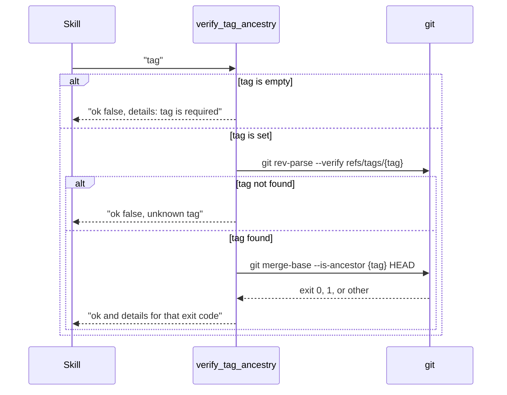

# tool-verify-tag-ancestry Specification

## Purpose
MCP tool `verify_tag_ancestry` checks whether a git tag is an ancestor of HEAD. It is registered as `INTERNAL — called by sdlc skills only`; no current skill calls it, and `plugins/sdlc/skills/ship/reference.md` forbids calling it from the ship pipeline. Output follows docs/mcp-output-contract.md.

## Requirements

### Requirement: Input and output fields
The tool SHALL accept one input field, `tag`, and return exactly the fields `ok` and `details`.

| Field | Type | Required | Encoding | Meaning |
|---|---|---|---|---|
| `tag` | string | yes (empty is handled, see below) | plain text, e.g. `v1.2.0` | Git tag to check against HEAD |

| Field | Meaning |
|---|---|
| `ok` | `true` only when the tag exists and is an ancestor of HEAD |
| `details` | One human-readable sentence explaining the result |

- The output has no `next` field, so the result carries no `**Next:**` line.

#### Scenario: Result shape
- **WHEN** `verify_tag_ancestry` is called and the project root resolves
- **THEN** the result carries `ok` and `details`
- **AND** the result carries no `**Next:**` line

### Requirement: Check order and git commands
The tool SHALL first confirm the tag exists, then test ancestry, running both git commands in the main worktree root.

Order of checks for one call:

- Commands run in the main worktree root, not in an active linked worktree.
- The tool never writes to the repository.

#### Scenario: Empty tag skips git
- **WHEN** `tag` is `""`
- **THEN** no git command runs
- **AND** `ok` is `false` with `details` `tag is required`

#### Scenario: Working tree unchanged
- **WHEN** the tool runs with an unknown tag such as `v0.0.0-does-not-exist`
- **THEN** the git working tree is unchanged after the call

### Requirement: Outcomes reported as payload
The tool SHALL report every tag outcome as a normal result with `ok` and `details`, never as a tool error.

| Condition | `ok` | `details` |
|---|---|---|
| `tag` empty | `false` | `tag is required` |
| `refs/tags/<tag>` not found | `false` | `unknown tag: '<tag>' does not exist in this repository (refs/tags/<tag> not found)` |
| `git merge-base --is-ancestor` exits 0 | `true` | `Tag '<tag>' is an ancestor of HEAD.` |
| `git merge-base --is-ancestor` exits 1 | `false` | `Tag '<tag>' is not an ancestor of HEAD. The release commit landed on a different branch. Delete the tag (git push origin :refs/tags/<tag>; git tag -d <tag>) and re-run the release workflow on the correct branch.` |
| `git merge-base` fails any other way | `false` | `git merge-base error for tag '<tag>': <git error>` |

#### Scenario: Tag on an ancestor commit
- **WHEN** tag `v1.0.0` points at a commit before HEAD on the current branch
- **THEN** `ok` is `true`
- **AND** `details` is `Tag 'v1.0.0' is an ancestor of HEAD.`

#### Scenario: Tag on a side branch
- **WHEN** tag `v2.0.0` points at a commit that exists only on another branch
- **THEN** `ok` is `false`
- **AND** `details` contains `not an ancestor`

#### Scenario: Unknown tag
- **WHEN** tag `v99.99.99` does not exist in the repository
- **THEN** `ok` is `false`
- **AND** `details` contains `does not exist`

#### Scenario: Other git failure
- **WHEN** `git merge-base --is-ancestor` exits with a code other than 0 or 1
- **THEN** `ok` is `false`
- **AND** `details` starts with `git merge-base error for tag '<tag>':`

### Requirement: Project root failure
The tool SHALL return an `InfraError` only when it cannot resolve the main worktree root.

| Condition | Class | Message / Suggestion (short) |
|---|---|---|
| Main worktree root cannot be resolved | `InfraError` | `resolve project root: <error>` / run `git worktree list --porcelain` to see why, fix it, retry `verify_tag_ancestry` |

#### Scenario: Not a git repository
- **WHEN** the main worktree root cannot be resolved
- **THEN** the tool returns an `InfraError` whose message starts with `resolve project root:`

### Requirement: Tool annotations
The tool SHALL register as read-only, idempotent, and closed-world.

| Annotation | Value |
|---|---|
| Title | `Check release tag ancestry` |
| `ReadOnly` | `true` |
| `Idempotent` | `true` |
| `OpenWorld` | `false` |

#### Scenario: Client lists tools
- **WHEN** an MCP client lists tools
- **THEN** `verify_tag_ancestry` reports `ReadOnly` `true` and `OpenWorld` `false`
