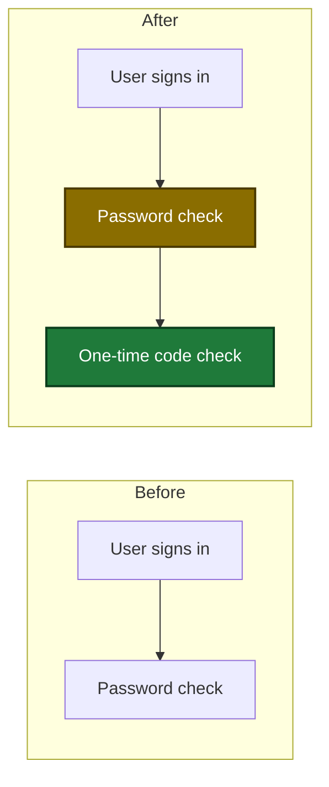

# Preplan (SDLC)

Preplan turns an idea into one topic file that `/sdlc:plan` can read as its
requirements file. The skill holds the dialogue and the judgement. The
`plan_support` tool holds the file I/O with known content: it loads the plan
guardrails and creates the topic file with its skeleton. The topic file is in
the main worktree, so it is the same in every worktree. The tool returns its
absolute path as `preplanFile`.

**Announce at start:** "I'm using preplan (sdlc v{sdlc_version})." - extract the version from the `sdlc:` line in the session-start system-reminder. If no version is in context, omit the parenthetical.

**Communication style:** Follow the `sdlc communication style` block in session context for every explanation, status line, summary, and AskUserQuestion text in this skill.

**Decision-framing rule:** Before each AskUserQuestion call, restate the facts the user needs: what is decided, what the choice changes, and the effect of each option.

---

## Topic file

The tool writes the skeleton once: a `# Preplan: <topic>` heading, a `**Status:** in progress` line, and the sections below in this order. The skill never writes the skeleton and never creates the file.

| Section | Content |
|---|---|
| `## Goal` | one or two sentences: the result the user wants |
| `## Users and effect` | who uses the change, what changes for them, what fails today |
| `## Flows` | one before/after Mermaid diagram with its text twin for each flow that a proposal changes, or the line `No flow change.` |
| `## Decisions` | a table with the columns `#`, `Decision` and `Reason`, one row for each proposal. A proposal is one row of this table, except a row whose `Decision` cell starts with `Moved:` (see Step 4). The `#` value of a row never changes and is never used again. The skill never deletes a row, so the next unused `#` value is one more than the highest `#` in the table |
| `## Open questions` | one bullet for each question that has no answer yet |
| `## Guardrail check` | a table with the columns `Proposal`, `Guardrail`, `Severity` and `Result`, one Step 4 result in each row. `Proposal` holds the `#` value of the proposal. `Guardrail` holds the `id` values that the row is about. A `pass` result holds its basis (see Step 4) |

### Topic file status

Each status change in this skill matches one row of this table. No other status change occurs.

| From | Event | To |
|---|---|---|
| no file | `preplan_context` creates the file | `in progress` |
| `in progress` | Step 5 | `ready for plan` |
| `in progress` | cancel | `paused` |
| `paused` or `ready for plan` | Step 2 on a new run | `in progress` |

---

## Flow

| Step | Action | Next |
|---|---|---|
| 0 | Announce. Take the topic from the argument, or ask one question for it | Step 1. On cancel: end. No file exists yet, so nothing changes |
| 1 | Call `plan_support({ action: "preplan_context", topic })` | Step 2. On a tool error: print it, then stop |
| 2 | Read `preplanFile`. If `preplanCreated` is false, set status `in progress` and list the open questions | Step 3 |
| 3 | Ask one question with AskUserQuestion. Challenge a vague answer with one follow-up question. Edit the topic file. If a proposal changes a flow, write a before/after Mermaid diagram and its text twin under `## Flows` | Step 3 route table |
| 4 | Check each proposal with no check row against each guardrail. Record one result row for each proposal in `## Guardrail check` | Step 4 route table |
| 5 | Set status `ready for plan`. Ask with AskUserQuestion: start `/sdlc:plan <preplanFile>` now, or stop | Step 5 route table |
| cancel | Set status `paused`. Keep the file | end |

Every exit state names its next instruction:

| Exit state | Where | Next instruction |
|---|---|---|
| cancelled before the file exists | Step 0 | end. Make no tool call |
| tool error | Step 1 | print the error's `## Do this` text as it is, then stop. Do not retry |
| cancelled during the dialogue | Step 3 or Step 4 | go to the cancel step: set status `paused`, keep the file, end |
| user stops at the handoff | Step 5 | end. Status stays `ready for plan` |
| plan skill ends | Step 5 | end |
| plan skill stops with an error | Step 5 | print the error. Status stays `ready for plan`. Tell the user to run `/sdlc:plan <preplanFile>`. End |

---

## Step 0: Announce and take the topic

Print the announce line. When the argument holds a topic, use it as the topic. When the argument is empty, ask one AskUserQuestion: "What is the short name of the topic? It becomes the topic file name." Offer a cancel option.

- The user gives a topic: go to Step 1.
- The user cancels: end. No file exists yet, so nothing changes.

## Step 1: Load the guardrails and the topic file

Make exactly one call:

```
plan_support({ action: "preplan_context", topic: "<topic>" })
```

Never call `plan_prepare`. It starts a plan run and prunes other runs.

| Result | Next |
|---|---|
| success | keep `guardrails`, `preplanFile`, `preplanCreated` and `summary`. Go to Step 2 |
| tool error (bad topic or failed create) | print the error's `## Do this` text as it is, then stop. Make no other call |

When the `summary` holds `Warning: <warning>.`, the guardrails are unavailable. Keep `<warning>`. The dialogue continues. Step 4 records the warning.

## Step 2: Read the topic file

Read `preplanFile`. The topic file is the only state of this skill, so a new run of the skill continues from it.

| `preplanCreated` | Action |
|---|---|
| `true` | the file holds the skeleton. Status is `in progress`. Go to Step 3 |
| `false` | set status `in progress` (status table row 4 when the status is `paused` or `ready for plan`; no change when it is `in progress`). Print the `## Open questions` bullets to the user. Go to Step 3 |

## Step 3: Ask one question

Dialogue rules:

- Ask about function and effect: who uses it, what changes, what fails. Do not ask about code.
- Ask one question at a time, with AskUserQuestion. Offer a "done" option and a "cancel" option.
- Restate the facts before each question. Do not assume that the user remembers an earlier answer.
- Challenge a vague answer with one follow-up question. Ask for the user, the effect, or the failure case that the answer leaves out.
- Pick the next question from the first gap: `## Goal`, then `## Users and effect`, then the `## Open questions` bullets, then a missing `## Flows` entry, then the next proposal.

After each answer, edit the topic file before the next question:

- Write the answer into the section that it fills.
- Add a new question to `## Open questions`. Remove a bullet when an answer closes it.
- Add a proposal as a new row of `## Decisions`, with the next unused `#` value.
- When a proposal changes a flow, write a before/after diagram and its text twin under `## Flows` (see **Mermaid rule**). When the user confirms that no flow changes, write the line `No flow change.` under `## Flows`.

Do not show a new proposal to the user as accepted before Step 4 checks it.

When an answer changes a proposal that already has a row in `## Guardrail check`, delete that row. Step 4 then checks the changed proposal again.

Step 3 routes (one row matches each answer):

| Answer to the Step 3 question | Next |
|---|---|
| cancel | cancel |
| "done", and the file has 0 proposals | Step 3: say that the topic has no proposal, then ask for one |
| "done", and the file has 1 or more proposals | Step 4 with `final` set |
| an answer that completes a new proposal or changes a proposal | Step 4 with `final` not set |
| any other answer | Step 3 |

## Step 4: Check the proposals against the guardrails

Check each proposal that has no row in `## Guardrail check`. Check it against each guardrail in `guardrails`. Each guardrail has an `id`, a `description` (the rule) and a `severity` (`error` or `warning`). A guardrail with no `severity` is `error`. Do this before the user sees the proposal as accepted.

Guardrail check rules:

| Conflict | Action | Result row |
|---|---|---|
| breaks one or more `error` guardrails | rework the proposal once, then check it again. If it still breaks an `error` guardrail, drop it | `dropped — <ids>`. After a rework that clears every `error` conflict: the row that matches the new check |
| breaks only `warning` guardrails | show the reason for each, ask the user once: keep or rework | keep: `kept — <ids>`. rework: no row. The proposal goes to `## Open questions` |
| no conflict | none | `pass — <basis>` |
| guardrails unavailable | continue | `unavailable — <warning>`. Step 4 counts it as `pass` |

How to write the rows:

- Write one row for each proposal. If the proposal breaks one guardrail, put its `id` in `Guardrail` and its severity in `Severity`. If it breaks more than one, list every `id` in `Guardrail`, separated by commas, and put the highest severity (`error` over `warning`) in `Severity`. The `Result` follows the highest severity. In the `Result` cell, `<ids>` is the same list of `id` values as in `Guardrail`.
- A proposal with no conflict gets one row: `Guardrail` lists every guardrail `id` that the skill checked, separated by commas. `Severity` is `—`. `Result` is `pass — <basis>`. `<basis>` gives, for each `id`, the fact of the proposal that clears that guardrail, in one short clause (for example `pass — G1: no new public API; G4: the change has a test`). A bare `pass` with no basis is not a valid row.
- When `guardrails` is empty, a proposal gets one row: `Guardrail` is `—`, `Severity` is `—`, `Result` is `pass — no guardrail configured`.
- When the guardrails are unavailable, give each proposal one row: `Guardrail` is `—`, `Severity` is `—`, `Result` is `unavailable — <warning>`.
- Rework: edit the `## Decisions` row so that it no longer breaks the guardrail. Tell the user in one line what changed and which guardrails caused it.
- Drop: keep the `## Decisions` row, so the check row still points to it. Start its `Decision` cell with `Dropped:`. Tell the user which guardrails caused the drop.
- Warning conflict: ask with AskUserQuestion. Restate the proposal, each guardrail `id`, and its `description`. Options: keep the proposal as it is, rework it later, or cancel. On rework, keep the row in `## Decisions` and start its `Decision` cell with `Moved:`. Add the proposal as a bullet to `## Open questions`. Write no check row. A `Moved:` row is not a proposal: Step 4 does not check it, and the Step 3 and Step 4 routes do not count it. When an answer brings the proposal back, add it as a new row with the next unused `#` value. On cancel, go to the cancel step.

Step 4 routes (one row matches each result):

| Step 4 result | Next |
|---|---|
| `final` set, every proposal has a row with `pass`, `kept` or `dropped`, at least one proposal is `pass` or `kept`, and `## Flows` has a diagram or the line `No flow change.` | Step 5 |
| any other result, including every proposal `dropped` | Step 3 |

When Step 4 goes back to Step 3 with `final` set, tell the user what is missing: a proposal that is not dropped, or a `## Flows` entry. Then ask about it.

## Step 5: Hand off to plan

Set status `ready for plan`. Then ask with AskUserQuestion. Restate the topic, the number of proposals that are `pass` or `kept`, and the path `preplanFile`. Options:

- **Start plan now** — runs `/sdlc:plan <preplanFile>` in this session. The plan skill reads the topic file as its requirements file.
- **Stop** — ends this skill. The topic file stays `ready for plan`.

Handoff call: "start" runs `Skill(sdlc:plan, <preplanFile>)` in the same session. No Agent worker exists, so no worker needs a stop. The plan skill asks its own questions with AskUserQuestion in the main session.

Step 5 routes (one row matches each result):

| Step 5 result | Next |
|---|---|
| user stops | end. Status stays `ready for plan` |
| user starts plan, and the plan skill ends | end |
| user starts plan, and the plan skill stops with an error | print the error. Status stays `ready for plan`. Tell the user to run `/sdlc:plan <preplanFile>`. End |

## Cancel

Set status `paused`. Keep the file. End. A new run of `/sdlc:preplan <topic>` with the same topic continues from the file.

---

## Mermaid rule

Each diagram in the topic file shows the before and the after state of one flow. Use only these two classDefs, copied exactly:

```
classDef new fill:#1f7a3a,stroke:#0b3d1c,color:#ffffff,stroke-width:2px
classDef changed fill:#8a6d00,stroke:#4a3a00,color:#ffffff,stroke-width:2px
```

Mark a new step with `:::new` and a changed step with `:::changed`. Below each diagram, write a numbered list with the same steps (the text twin). A reader who cannot render Mermaid reads the text twin.

Example of one `## Flows` entry:



Before:
1. The user signs in.
2. The system checks the password.

After:
1. The user signs in.
2. The system checks the password (changed: it no longer ends the sign-in).
3. The system checks a one-time code (new).

---

## Rules

- Never call `plan_prepare`. This skill starts no plan run.
- Never write the skeleton and never create the topic file. `preplan_context` creates it.
- Write and edit only the file at `preplanFile`. Never write a topic file under a `plans/` directory: after each write there, the plan format hook checks the file as a plan and reports plan format findings, because a topic file is not a plan.
- Edit the topic file after each answer, before the next question.
- Check each proposal against the guardrails before the user sees it as accepted.
- Ask one question at a time, about function and effect, not about code.
- This skill starts no sub-agents.
- Never paraphrase a tool error's `## Do this` text. Print it exactly as it is.
